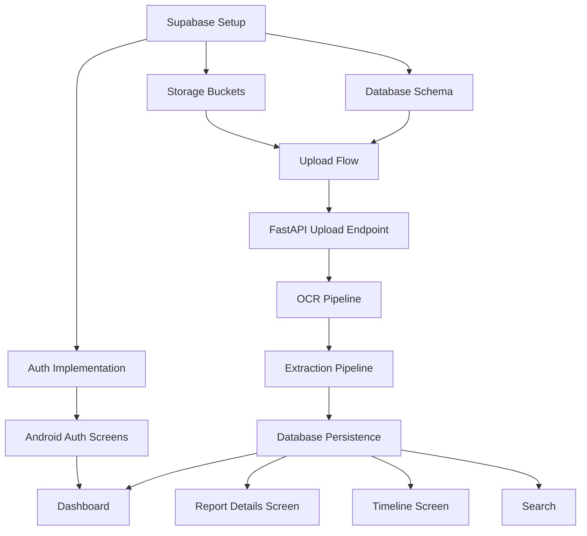
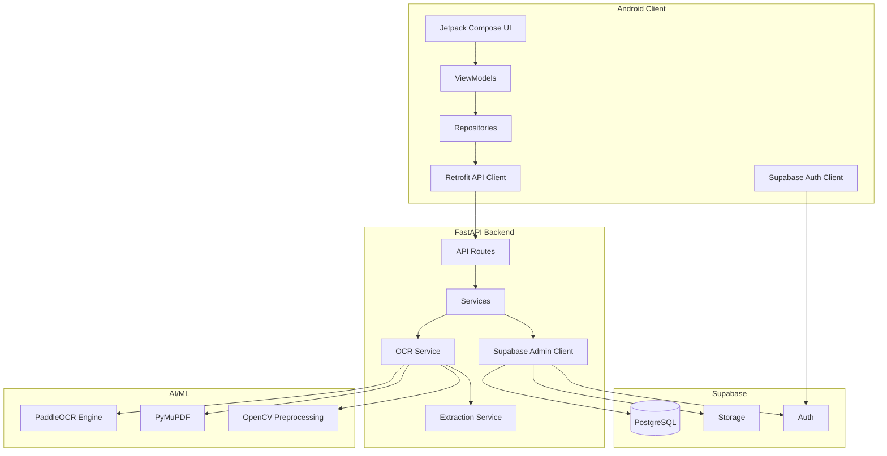
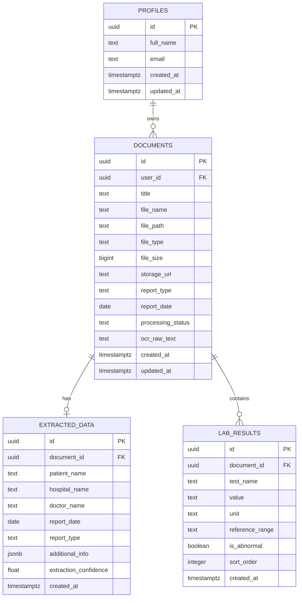
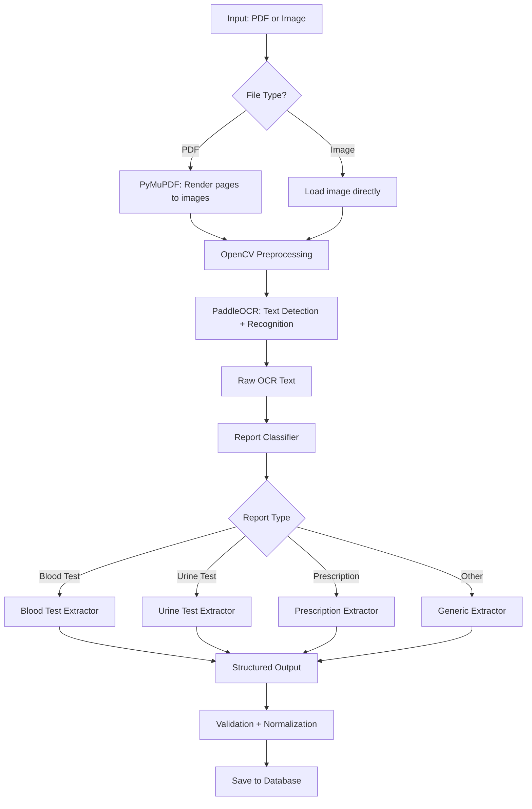

# MEMO — Medical Evidence Management & Organization
## Complete Development Plan

**Version:** 1.0  
**Date:** 2026-10-03  
**Status:** Implementation-Ready Blueprint  

---

## A. Executive Summary

MEMO is an Android application that converts scattered medical reports (PDFs, images) into an organized, searchable medical history. It is **not** a diagnostic system — it is a personal medical-records organizer.

### Core Value Proposition
A user takes a photo of a blood-test report or picks a PDF. MEMO uploads it, runs OCR, extracts structured data (patient name, date, test names, values, units, reference ranges), and files it into a chronological medical timeline. The original document is always preserved and accessible.

### Technical Architecture (One Sentence)
Kotlin/Compose Android client → Python/FastAPI backend → Supabase (Auth + PostgreSQL + Storage) + PaddleOCR pipeline.

### MVP Scope
The one-day MVP delivers a single, complete vertical slice: **Register → Login → Dashboard → Upload Report → OCR + Extraction → Structured Report Details → Medical Timeline → Search → Logout**. Every screen is polished with a healthcare-appropriate design system. The demo uses 2–3 synthetic medical reports to prove the flow end-to-end.

### Key Architectural Decisions

| Decision | Choice | Rationale |
|---|---|---|
| Frontend | Kotlin + Jetpack Compose | Modern, declarative, first-class Android support |
| Backend | Python + FastAPI | Fast to build, excellent for AI/ML integration |
| Auth | Supabase Auth | Managed auth with JWT, no custom auth server |
| Database | Supabase PostgreSQL | Managed, RLS-capable, free tier sufficient |
| Storage | Supabase Storage | Integrated with auth, bucket policies |
| OCR | PaddleOCR (server-side) | Free, accurate, multilingual, no API key needed |
| PDF Processing | PyMuPDF (fitz) | Fastest Python PDF library, renders pages to images |
| Extraction | Regex + heuristic parsing | Deterministic, debuggable, no LLM dependency for MVP |
| Image Loading | Coil | Kotlin-first, Compose-native, lightweight |
| API Client | Retrofit + Moshi | Industry standard, type-safe, coroutine support |

### Assumptions

1. The demo runs on a single machine: Android emulator + local FastAPI server (or deployed to a free tier).
2. Supabase free tier is sufficient for demo purposes.
3. Medical reports for the demo are synthetic, English-language, printed (not handwritten).
4. The professor demo does not require real patient data, HIPAA compliance, or production deployment.
5. Internet connectivity is available during the demo.
6. The developer has Android Studio and Python 3.10+ installed.
7. PaddleOCR can run on the developer's machine (CPU mode is acceptable for demo).

---

## B. MVP Scope

### Core Functional Requirements (MVP)

| # | Requirement | Priority | MVP? |
|---|---|---|---|
| FR-1 | User registration (email + password) | Must | ✅ |
| FR-2 | User login | Must | ✅ |
| FR-3 | User logout | Must | ✅ |
| FR-4 | Session persistence (JWT) | Must | ✅ |
| FR-5 | Dashboard with report count + recent reports | Must | ✅ |
| FR-6 | Upload PDF or image from device | Must | ✅ |
| FR-7 | Store original document in Supabase Storage | Must | ✅ |
| FR-8 | OCR processing via PaddleOCR | Must | ✅ |
| FR-9 | Structured extraction (name, date, hospital, tests, values) | Must | ✅ |
| FR-10 | Report type classification | Must | ✅ |
| FR-11 | Display extracted data on report-details screen | Must | ✅ |
| FR-12 | View original document | Must | ✅ |
| FR-13 | Chronological medical timeline | Must | ✅ |
| FR-14 | Basic text search across reports | Must | ✅ |
| FR-15 | Processing status indication | Must | ✅ |
| FR-16 | Error handling for upload/OCR failures | Must | ✅ |

### Explicitly Excluded from One-Day Demo

| Feature | Reason |
|---|---|
| Forgot-password flow | Supabase handles email reset; no custom UI needed for demo |
| Dark mode | Design the tokens for it, implement in post-demo |
| Offline mode | Adds significant complexity |
| Push notifications | Not core to the demo flow |
| Report sharing | Post-MVP |
| Report deletion/editing | Post-MVP (add later) |
| Multi-language OCR | English-only for MVP |
| Handwritten report support | Unreliable for demo |
| LLM-based extraction | Only if regex pipeline proves too fragile during dev |
| Docker/Jenkins | Post-MVP infrastructure |
| CI/CD pipeline | Post-MVP |
| Unit test suite | Post-MVP (manual QA for demo) |
| Report comparison | Future feature |
| Charts/graphs of lab values | Future feature |

### Functional Dependencies



### Technical Risks

| Risk | Severity | Likelihood | Mitigation |
|---|---|---|---|
| PaddleOCR installation issues | High | Medium | Test installation first; have Tesseract as fallback |
| OCR accuracy on varied report formats | Medium | High | Use 2-3 controlled synthetic reports for demo |
| Supabase RLS misconfiguration | High | Medium | Test policies with two users before demo |
| Android emulator performance | Medium | Low | Use a physical device if available |
| FastAPI ↔ Android connectivity | Medium | Medium | Use ngrok or local network; test early |
| Time overrun on UI polish | Medium | High | Build functional UI first, polish in final hour |
| Extraction regex fragility | Medium | High | Design synthetic reports to match extraction patterns |

### Implementation Bottlenecks

1. **PaddleOCR setup** — Can take 15-30 minutes if dependencies conflict. Install and test before starting any other backend work.
2. **Supabase Storage policies** — Getting signed URLs and upload policies right with RLS requires careful testing.
3. **PDF-to-image conversion** — PyMuPDF needs to render pages; test this pipeline early.
4. **Android file picker integration** — Content URIs, permissions, and multipart upload can be fiddly.

---

## C. Full Architecture

### System Architecture Diagram



### Responsibility Matrix

| Component | Responsibilities | Does NOT do |
|---|---|---|
| **Android Client** | UI rendering, navigation, auth flow (via Supabase SDK), file selection, API calls, local state management, JWT token management | OCR, extraction, direct DB access, store service-role keys |
| **FastAPI Backend** | Receives uploads, orchestrates OCR pipeline, runs extraction, writes structured data to DB, manages storage uploads, validates auth tokens | Render UI, manage user sessions, store files locally long-term |
| **Supabase Auth** | User registration, login, JWT issuance, session refresh, password reset | Application-level authorization logic |
| **Supabase PostgreSQL** | Persistent structured data storage, RLS enforcement, indexes for search | Full-text search (for MVP; basic ILIKE is sufficient) |
| **Supabase Storage** | Original document storage (PDFs, images), signed URL generation | Image processing, OCR |
| **PaddleOCR** | Text detection + recognition from images | Classification, extraction, understanding |
| **Extraction Service** | Regex/heuristic parsing of OCR text, report classification, field extraction | OCR, storage, authentication |

### Data Flow: Upload-to-Timeline

```
1. User selects file on Android
2. Android sends file + metadata to FastAPI (POST /api/v1/reports/upload)
   - Auth: Bearer JWT token in header
3. FastAPI validates JWT with Supabase
4. FastAPI uploads original file to Supabase Storage (bucket: medical-documents/{user_id}/)
5. FastAPI creates a `documents` record in PostgreSQL (status: "processing")
6. FastAPI converts PDF pages to images (PyMuPDF) or loads image directly
7. FastAPI preprocesses images (OpenCV: deskew, contrast, threshold if needed)
8. FastAPI runs PaddleOCR → raw text
9. FastAPI runs Extraction Service → structured fields
10. FastAPI classifies report type
11. FastAPI writes extracted data to `extracted_data` + `lab_results` tables
12. FastAPI updates document status to "completed"
13. Android polls or receives response with structured data
14. Android displays report details and updates dashboard/timeline
```

### Client-Side vs Server-Side

| Operation | Where | Why |
|---|---|---|
| Auth (login/register) | Client → Supabase directly | Supabase SDK handles this natively; no need to proxy |
| File selection | Client | Android system file picker |
| File upload | Client → FastAPI → Supabase Storage | FastAPI needs to process the file anyway; avoid double upload |
| OCR | Server (FastAPI) | PaddleOCR is heavy; cannot run on Android |
| Extraction | Server (FastAPI) | Centralized logic, easier to update |
| Data queries | Client → FastAPI | FastAPI can enforce business logic; or client → Supabase directly with RLS |
| Search | Client → FastAPI | Server-side search for consistency |

> [!IMPORTANT]
> **For the MVP, data queries (fetching reports, timeline, search) will go through FastAPI** rather than directly from Android to Supabase. This keeps the Android client thin and avoids embedding Supabase service keys in the app. The Android client only talks to Supabase directly for authentication.

---

## D. UI/UX Design Strategy

### Design Philosophy

MEMO should feel like a **personal health companion** — trustworthy, calm, organized. The design language borrows from modern health-tech apps like Apple Health, MyChart, and Practo, but stays simpler.

### Visual Principles

| Principle | Application |
|---|---|
| **Trustworthy** | Cool-toned palette (teal/sage), clean typography, generous whitespace |
| **Calm** | No aggressive animations, no red accents except for errors, muted backgrounds |
| **Organized** | Clear visual hierarchy, card-based layouts, consistent spacing |
| **Accessible** | Minimum 4.5:1 contrast ratio, 14sp minimum body text, touch targets ≥48dp |
| **Modern** | Rounded corners, subtle shadows, Material 3 components, no skeuomorphism |
| **Healthcare-appropriate** | Teal/green tones (healing), clean white surfaces, medical iconography |

### Typography Strategy

- **Font Family:** Google Sans / Inter (fallback to system sans-serif)
- **Headings:** Semi-bold, larger sizes, high contrast
- **Body:** Regular weight, comfortable line height (1.5)
- **Data values:** Monospace or medium-weight for lab results
- **No tiny text** — smallest text on screen should be 12sp (captions only)

### Interaction Patterns

| Pattern | Usage |
|---|---|
| Bottom Navigation | Primary navigation (Dashboard, Timeline, Search, Profile) |
| FAB (Floating Action Button) | Upload new report — always visible from Dashboard |
| Pull-to-refresh | Dashboard, report list |
| Swipe back | Navigation hierarchy |
| Bottom Sheet | File type selection, filters |
| Snackbar | Success/error feedback |
| Skeleton loading | Content loading states |
| Progress stepper | Upload/processing flow |

### Empty State Strategy

Every list/content screen has a designed empty state with:
- Illustration or icon
- Brief message explaining what will appear here
- CTA to take the primary action (e.g., "Upload your first report")

---

## E. Screen-by-Screen Specification

### Screen 1: Splash Screen

| Aspect | Specification |
|---|---|
| **Purpose** | Brand impression + auth-state check |
| **User Goal** | None (passive) |
| **UI Components** | App logo, app name "MEMO", tagline "Every Report. One Medical Memory." |
| **Layout** | Centered vertically, logo above text |
| **Primary CTA** | None (auto-navigates) |
| **Loading State** | This IS the loading state |
| **Navigation** | Auto-navigates to Dashboard (if authenticated) or Login (if not) after 1.5s |
| **Mobile Usability** | Full-screen, no interaction needed |

### Screen 2: Login Screen

| Aspect | Specification |
|---|---|
| **Purpose** | Authenticate returning user |
| **User Goal** | Enter credentials and access their records |
| **UI Components** | App logo (small), "Welcome back" heading, email field, password field (with toggle visibility), "Log In" button, "Don't have an account? Sign Up" link |
| **Layout** | Top: logo + greeting. Middle: form fields. Bottom: CTA button + sign-up link |
| **Primary CTA** | "Log In" button (full-width, filled, primary color) |
| **Secondary Actions** | "Sign Up" text link |
| **Empty State** | N/A |
| **Loading State** | Button shows circular progress indicator, fields disabled |
| **Error State** | Inline error below relevant field. Snackbar for network errors. "Invalid credentials" shown below password field |
| **Success State** | Navigate to Dashboard |
| **Navigation** | → Dashboard (on success), → Register (on "Sign Up" tap) |
| **Mobile Usability** | Keyboard-aware scrolling, email keyboard type, password IME action → submit |

### Screen 3: Register Screen

| Aspect | Specification |
|---|---|
| **Purpose** | Create new account |
| **User Goal** | Register to start using MEMO |
| **UI Components** | "Create Account" heading, full name field, email field, password field (with requirements hint), confirm password field, "Create Account" button, "Already have an account? Log In" link |
| **Layout** | Same structure as Login |
| **Primary CTA** | "Create Account" button |
| **Secondary Actions** | "Log In" link |
| **Loading State** | Button loading indicator |
| **Error State** | Inline validation (email format, password length ≥ 8, passwords match). Server errors in snackbar |
| **Success State** | Navigate to Dashboard (auto-login) or show "Check your email" if Supabase requires confirmation |
| **Navigation** | → Dashboard or → Login |
| **Mobile Usability** | Same as Login |

### Screen 4: Dashboard / Home

| Aspect | Specification |
|---|---|
| **Purpose** | Central hub — see overview, take primary actions |
| **User Goal** | Understand their medical record status, quickly upload or view reports |
| **UI Components** | Top: greeting ("Hello, {name}"), date. Stats row: total reports count, reports this month. Section: "Recent Reports" — last 3-5 reports as cards (report type icon, title, date, hospital). FAB: "+" upload button |
| **Layout** | Scrollable column. Greeting → Stats cards (horizontal row) → Recent reports section (vertical list of cards) |
| **Primary CTA** | FAB "+" to upload new report |
| **Secondary Actions** | Tap report card → Report Details. "View All" → Reports list |
| **Empty State** | Illustration + "No reports yet" + "Upload your first medical report to get started" + Upload button |
| **Loading State** | Skeleton shimmer on stats and report cards |
| **Error State** | Retry banner at top |
| **Success State** | Populated stats + report list |
| **Navigation** | Part of bottom navigation. FAB → Upload. Card tap → Report Details |
| **Mobile Usability** | Stats cards should not require horizontal scroll on small screens. Report cards should show key info without truncation |

### Screen 5: Upload Report

| Aspect | Specification |
|---|---|
| **Purpose** | Select and upload a medical document |
| **User Goal** | Get a physical report into the digital system |
| **UI Components** | Step indicator (4 steps: Select → Upload → Process → Done). File selection area (large tappable zone with dashed border, camera icon + document icon). Selected file preview (thumbnail + filename + file size). Optional: report title field, report date picker. "Upload & Process" button |
| **Layout** | Step indicator at top → File selection area → File preview (after selection) → Optional metadata → Upload button |
| **Primary CTA** | "Upload & Process" |
| **Secondary Actions** | "Change file", "Cancel" |
| **Empty State** | File selection zone with "Tap to select a PDF or image" |
| **Loading State** | Progress through steps: "Uploading..." → "Reading document..." → "Extracting information..." → "✓ Complete" |
| **Error State** | Error at specific step with retry option. "File too large (max 10MB)", "Unsupported format", "Upload failed — check your connection" |
| **Success State** | Checkmark animation → "Report processed successfully" → "View Report" button |
| **Navigation** | Back → Dashboard. Success → Report Details |
| **Mobile Usability** | Large touch target for file selection. Progress steps visible without scrolling |

#### Upload Processing States (Detail)

```
Step 1: "Uploading document..."        [progress bar]
Step 2: "Reading document..."          [progress bar]  
Step 3: "Extracting information..."    [progress bar]
Step 4: "Complete ✓"                   [checkmark animation]
```

#### Error Handling (Detail)

| Scenario | Behavior |
|---|---|
| Unsupported format | Immediate inline error: "Please select a PDF, JPG, or PNG file" |
| File > 10MB | Immediate inline error: "File is too large. Maximum size is 10MB" |
| Upload fails (network) | Error at Step 1 with "Retry" button |
| OCR fails | Error at Step 2: "Could not read the document. Please try a clearer image." + "Retry" / "Upload anyway" (saves document without extraction) |
| Extraction fails | Warning at Step 3: "We couldn't extract all information. You can review what was found." → proceed to report details |
| Network lost mid-process | Modal: "Connection lost. Your upload will resume when connected." (or simply show error + retry) |

### Screen 6: Reports List

| Aspect | Specification |
|---|---|
| **Purpose** | Browse all uploaded reports |
| **User Goal** | Find a specific report |
| **UI Components** | Search bar at top. Filter chips (All, Blood Tests, Prescriptions, Imaging, Other). Report cards in a vertical list (type icon, title, date, hospital, status badge). Sort option (newest first / oldest first) |
| **Layout** | Search bar → Filter chips (horizontal scroll) → Report list (vertical scroll) |
| **Primary CTA** | Tap report card → Report Details |
| **Secondary Actions** | Search, filter, sort |
| **Empty State** | "No reports found" (with filter active) or "No reports yet — upload your first report" |
| **Loading State** | Skeleton list items |
| **Error State** | Retry banner |
| **Navigation** | Card tap → Report Details. Accessible from bottom nav or Dashboard "View All" |

### Screen 7: Report Details

| Aspect | Specification |
|---|---|
| **Purpose** | View all information about a single report |
| **User Goal** | Review extracted medical data and access the original document |
| **UI Components** | Header: report type chip + title + date. Info card: hospital/lab name, patient name (if extracted). Section: "Extracted Results" — table/list of (test name, value, unit, reference range) with out-of-range highlighting. Status indicator: extraction completeness. "View Original Report" button (prominent). Raw OCR text (collapsible, for transparency) |
| **Layout** | Scrollable column: Header → Info Card → Extracted Results → View Original button → OCR text (collapsed) |
| **Primary CTA** | "View Original Report" |
| **Secondary Actions** | Expand raw OCR text, share (post-MVP) |
| **Empty State** | N/A (always has at least the original document) |
| **Loading State** | Skeleton for extracted data if still processing |
| **Error State** | If extraction failed: "We couldn't extract structured data from this report. You can still view the original document below." |
| **Success State** | All sections populated |
| **Navigation** | Back → Reports List or Dashboard. "View Original" → full-screen document viewer |
| **Mobile Usability** | Results table should be horizontally scrollable if needed. Values should be large enough to read easily |

#### Extracted vs. Original — Visual Distinction

```
┌──────────────────────────────────────┐
│  ℹ️ Extracted Information             │
│  This data was automatically          │
│  extracted. Always verify with the    │
│  original report.                     │
│                                       │
│  ┌──────────┬───────┬──────┬───────┐ │
│  │ Test     │ Value │ Unit │ Ref   │ │
│  ├──────────┼───────┼──────┼───────┤ │
│  │ Hb       │ 12.5  │ g/dL │11-16 │ │
│  │ WBC      │ 4500  │ /μL  │4-11k │ │
│  └──────────┴───────┴──────┴───────┘ │
│                                       │
│  [📄 View Original Report]           │
└──────────────────────────────────────┘
```

> [!NOTE]
> The disclaimer "This data was automatically extracted. Always verify with the original report." must appear on every report-details screen. This is not optional.

### Screen 8: Medical Timeline

| Aspect | Specification |
|---|---|
| **Purpose** | Chronological view of all medical records |
| **User Goal** | See their medical history at a glance |
| **UI Components** | Year headers. Month subheaders. Timeline line (vertical, left-aligned). Timeline nodes (colored by report type). Each node: date, report type, title, hospital. Tap → Report Details |
| **Layout** | Vertical scrollable timeline, grouped by year → month |
| **Primary CTA** | Tap any timeline entry → Report Details |
| **Empty State** | "Your medical timeline is empty. Upload a report to start building your history." + Upload button |
| **Loading State** | Skeleton timeline nodes |
| **Navigation** | Part of bottom navigation. Node tap → Report Details |
| **Mobile Usability** | Timeline should not require horizontal scrolling. Date and type should be readable at a glance |

#### Timeline Visual Structure

```
── 2026 ──────────────────────────

   October
   ● 02 Oct — Blood Test (CBC)
     ABC Diagnostics
   
   September  
   ● 18 Sep — Prescription
     XYZ Clinic
   
   ● 04 Sep — Urine Analysis
     ABC Diagnostics

   August
   ● 12 Aug — Ultrasound Report
     City Hospital
```

### Screen 9: Search

| Aspect | Specification |
|---|---|
| **Purpose** | Find specific reports or medical data |
| **User Goal** | Quickly locate a test result, hospital, or report |
| **UI Components** | Search bar (auto-focus on entry). Recent searches (initially). Search results as report cards. "No results" state |
| **Layout** | Search bar → Results list |
| **Primary CTA** | Tap result → Report Details |
| **Empty State** | Before search: "Search your medical records" + example queries ("Try: hemoglobin, blood test, ABC Diagnostics"). After search with no results: "No reports matching '{query}'" |
| **Loading State** | Subtle loading indicator below search bar |
| **Navigation** | Part of bottom navigation. Result tap → Report Details |

### Screen 10: Profile / Settings

| Aspect | Specification |
|---|---|
| **Purpose** | Account management |
| **User Goal** | View account info, log out |
| **UI Components** | User name, email. Stats (total reports, member since). "Log Out" button. App version |
| **Layout** | Simple centered column |
| **Primary CTA** | "Log Out" |
| **Navigation** | Part of bottom navigation. Logout → Login screen (clear backstack) |

### Screen 11: Document Viewer

| Aspect | Specification |
|---|---|
| **Purpose** | View original uploaded document |
| **User Goal** | See the actual medical report as uploaded |
| **UI Components** | Full-screen document/image viewer. Pinch-to-zoom. Page indicator (for multi-page PDFs). Close/back button |
| **Layout** | Full-screen with toolbar overlay |
| **Navigation** | Back → Report Details |

### Bottom Navigation Structure

```
[🏠 Home]   [📋 Reports]   [📊 Timeline]   [🔍 Search]   [👤 Profile]
```

> [!TIP]
> For the MVP, consider simplifying to 4 tabs: **Home, Timeline, Search, Profile** — with the Reports list accessible from Home. This reduces implementation time. 5 tabs is fine if time allows.

---

## F. Design System

### Color Palette

#### Primary Colors
```
Primary:           #0D9488  (Teal 600 — main brand color)
Primary Container: #CCFBF1  (Teal 100 — light teal for cards/backgrounds)
On Primary:        #FFFFFF  (White text on primary)
On Primary Cont:   #0F766E  (Teal 700 — text on primary container)
```

#### Background & Surface
```
Background:         #FAFBFC  (Very light gray — page background)
Surface:            #FFFFFF  (White — card surfaces)
Surface Variant:    #F1F5F9  (Slate 100 — secondary surfaces)
Outline:            #CBD5E1  (Slate 300 — borders, dividers)
Outline Variant:    #E2E8F0  (Slate 200 — subtle borders)
```

#### Text Colors
```
On Background:      #0F172A  (Slate 900 — primary text)
On Surface:         #1E293B  (Slate 800 — card text)
On Surface Variant: #64748B  (Slate 500 — secondary text)
Caption:            #94A3B8  (Slate 400 — tertiary/caption text)
```

#### Semantic Colors
```
Success:            #059669  (Emerald 600 — in-range values, completed)
Success Container:  #D1FAE5  (Emerald 100)
Warning:            #D97706  (Amber 600 — partially extracted, attention)
Warning Container:  #FEF3C7  (Amber 100)
Error:              #DC2626  (Red 600 — errors, out-of-range values)
Error Container:    #FEE2E2  (Red 100)
Info:               #2563EB  (Blue 600 — informational)
Info Container:     #DBEAFE  (Blue 100)
```

#### Report Type Colors
```
Blood Test:         #0D9488  (Teal)
Urine Test:         #7C3AED  (Violet)
Prescription:       #2563EB  (Blue)
Imaging:            #EA580C  (Orange)
Other:              #64748B  (Slate)
```

### Typography

| Style | Size | Weight | Line Height | Usage |
|---|---|---|---|---|
| Display | 28sp | SemiBold (600) | 36sp | Screen titles (rare) |
| Headline | 22sp | SemiBold (600) | 28sp | Section headers |
| Title Large | 20sp | Medium (500) | 26sp | Card titles, report names |
| Title Medium | 16sp | SemiBold (600) | 22sp | Subsection headers |
| Body Large | 16sp | Regular (400) | 24sp | Primary body text |
| Body Medium | 14sp | Regular (400) | 20sp | Secondary body text |
| Body Small | 12sp | Regular (400) | 16sp | Captions, timestamps |
| Label Large | 14sp | SemiBold (600) | 20sp | Buttons, chips |
| Label Medium | 12sp | Medium (500) | 16sp | Small labels |
| Data Value | 16sp | Medium (500) | 22sp | Lab values (use monospace or tabular figures) |

**Font Family:** Inter (Google Fonts) — clean, medical-appropriate, excellent readability

### Spacing System

```
xs:   4dp
sm:   8dp
md:   12dp
lg:   16dp
xl:   20dp
2xl:  24dp
3xl:  32dp
4xl:  40dp
5xl:  48dp
```

### Component Specifications

#### Buttons

| Type | Style |
|---|---|
| Primary (filled) | Background: Primary, Text: White, Height: 48dp, Corner: 12dp |
| Secondary (outlined) | Border: Primary, Text: Primary, Height: 48dp, Corner: 12dp |
| Text button | Text: Primary, no background, Height: 40dp |
| FAB | Background: Primary, Icon: White, Size: 56dp, Corner: 16dp, Elevation: 6dp |

#### Text Fields

```
Height:           56dp
Corner Radius:    12dp
Border:           1dp, Outline color (unfocused), Primary (focused)
Background:       Surface
Label:            Body Small, On Surface Variant
Input Text:       Body Large, On Surface
Error:            Body Small, Error color
```

#### Cards

```
Corner Radius:    16dp
Elevation:        1dp (subtle shadow)
Background:       Surface (White)
Padding:          16dp
Border:           None (use shadow) or 1dp Outline Variant
```

#### Chips / Tags

```
Height:           32dp
Corner Radius:    8dp
Padding H:        12dp
Text:             Label Medium
Selected:         Primary Container bg, On Primary Container text
Unselected:       Surface Variant bg, On Surface Variant text
```

#### Shadows / Elevation

```
Level 0:  none
Level 1:  0dp 1dp 3dp rgba(0,0,0,0.08)   — cards
Level 2:  0dp 2dp 6dp rgba(0,0,0,0.10)   — raised cards
Level 3:  0dp 4dp 12dp rgba(0,0,0,0.12)  — FAB, modals
```

### Dark / Light Theme Strategy

- **MVP:** Light theme only.
- **Post-MVP:** Define dark-theme tokens using the same semantic names but inverted values. Compose's `MaterialTheme` makes switching trivial once tokens are defined.

### Icon Strategy

- Use Material Icons (Outlined variant) for navigation and actions
- Use custom/healthcare-specific icons only for report types (blood drop, pill, scan)
- Consistent 24dp icon size in navigation, 20dp inline

---

## G. Backend Architecture

### FastAPI Application Structure

```
backend/
├── app/
│   ├── __init__.py
│   ├── main.py              # FastAPI app entry, CORS, lifespan
│   ├── config.py            # Settings from environment variables
│   ├── dependencies.py      # Dependency injection (auth, supabase client)
│   ├── routers/
│   │   ├── __init__.py
│   │   ├── auth.py          # Auth-related routes (verify token, get profile)
│   │   ├── reports.py       # Upload, list, get, search reports
│   │   └── health.py        # Health check endpoint
│   ├── services/
│   │   ├── __init__.py
│   │   ├── supabase_service.py   # Supabase client wrapper
│   │   ├── storage_service.py    # File upload to Supabase Storage
│   │   ├── ocr_service.py        # PaddleOCR integration
│   │   ├── extraction_service.py # Structured data extraction
│   │   └── report_service.py     # Business logic for reports
│   ├── models/
│   │   ├── __init__.py
│   │   ├── schemas.py       # Pydantic request/response models
│   │   └── enums.py         # Report types, processing status
│   └── utils/
│       ├── __init__.py
│       ├── pdf_utils.py     # PDF-to-image conversion
│       └── image_utils.py   # Image preprocessing
├── tests/
│   ├── __init__.py
│   ├── test_upload.py
│   ├── test_ocr.py
│   └── test_extraction.py
├── sample_reports/           # Synthetic test documents
├── requirements.txt
├── .env.example
└── Dockerfile
```

### Why Each Component Exists

| Component | Purpose | Alternatives Rejected |
|---|---|---|
| **FastAPI** | Async Python web framework, auto-generates OpenAPI docs | Flask (slower, no async), Django (too heavy) |
| **Supabase Python Client** | Server-side access to auth verification, DB, storage | Direct psycopg2 (loses Supabase ecosystem benefits) |
| **PaddleOCR** | Accurate, free, local OCR. No API keys or costs | Tesseract (lower accuracy), Google Vision (costs money), AWS Textract (costs money) |
| **PyMuPDF** | Fast PDF rendering to images for OCR | pdf2image (requires poppler, harder to install) |
| **OpenCV** | Image preprocessing (contrast, threshold) to improve OCR | Pillow (fewer capabilities) |
| **Pydantic** | Request/response validation, serialization | Manual validation (error-prone) |

### Configuration Management

```python
# config.py — all from environment variables
class Settings(BaseSettings):
    supabase_url: str
    supabase_service_role_key: str  # Server-side only, NEVER in Android
    supabase_anon_key: str
    cors_origins: list[str] = ["*"]  # Tighten in production
    max_file_size_mb: int = 10
    
    class Config:
        env_file = ".env"
```

> [!CAUTION]
> The `supabase_service_role_key` grants full access to all data, bypassing RLS. It must **never** be exposed in the Android client, API responses, Git history, or logs. Use `.env` files and `.gitignore`.

---

## H. Database Schema

### Entity Relationship Diagram



### Table Definitions

#### `profiles`

| Column | Type | Constraints | Notes |
|---|---|---|---|
| `id` | `uuid` | PK, references `auth.users(id)` | Auto-set from Supabase Auth |
| `full_name` | `text` | NOT NULL | User's display name |
| `email` | `text` | NOT NULL | From auth signup |
| `created_at` | `timestamptz` | DEFAULT now() | |
| `updated_at` | `timestamptz` | DEFAULT now() | |

**Purpose:** Stores user profile info linked to Supabase Auth. Created via a database trigger on `auth.users` insert.

**Indexes:** Primary key on `id`.

#### `documents`

| Column | Type | Constraints | Notes |
|---|---|---|---|
| `id` | `uuid` | PK, DEFAULT gen_random_uuid() | |
| `user_id` | `uuid` | FK → profiles(id), NOT NULL | Owner |
| `title` | `text` | | User-provided or auto-generated |
| `file_name` | `text` | NOT NULL | Original filename |
| `file_path` | `text` | NOT NULL | Path in Supabase Storage |
| `file_type` | `text` | NOT NULL | "pdf", "image/jpeg", "image/png" |
| `file_size` | `bigint` | | In bytes |
| `storage_url` | `text` | | Public/signed URL |
| `report_type` | `text` | DEFAULT 'other' | "blood_test", "urine_test", "prescription", "imaging", "other" |
| `report_date` | `date` | | Extracted or user-provided date of report |
| `processing_status` | `text` | DEFAULT 'pending' | "pending", "processing", "completed", "failed", "partial" |
| `ocr_raw_text` | `text` | | Full OCR output for search |
| `processing_error` | `text` | | Error message if failed |
| `created_at` | `timestamptz` | DEFAULT now() | Upload time |
| `updated_at` | `timestamptz` | DEFAULT now() | |

**Purpose:** Primary record for each uploaded medical document.

**Indexes:**
- `idx_documents_user_id` on `user_id`
- `idx_documents_report_date` on `report_date DESC`
- `idx_documents_created_at` on `created_at DESC`
- `idx_documents_search` — GIN index on `to_tsvector('english', coalesce(title,'') || ' ' || coalesce(ocr_raw_text,''))` (for full-text search — implement if time permits, otherwise ILIKE is fine)

#### `extracted_data`

| Column | Type | Constraints | Notes |
|---|---|---|---|
| `id` | `uuid` | PK, DEFAULT gen_random_uuid() | |
| `document_id` | `uuid` | FK → documents(id), UNIQUE, NOT NULL | One-to-one |
| `patient_name` | `text` | | Extracted patient name |
| `hospital_name` | `text` | | Extracted hospital/lab |
| `doctor_name` | `text` | | Extracted doctor name |
| `report_date` | `date` | | Extracted date (may differ from document.report_date) |
| `report_type` | `text` | | Classified type |
| `additional_info` | `jsonb` | DEFAULT '{}' | Flexible key-value for anything else extracted |
| `extraction_confidence` | `float` | | 0.0 to 1.0, rough confidence estimate |
| `created_at` | `timestamptz` | DEFAULT now() | |

**Purpose:** Structured metadata extracted from the document. One-to-one with `documents`.

**Indexes:** `idx_extracted_data_document_id` on `document_id`.

#### `lab_results`

| Column | Type | Constraints | Notes |
|---|---|---|---|
| `id` | `uuid` | PK, DEFAULT gen_random_uuid() | |
| `document_id` | `uuid` | FK → documents(id), NOT NULL | Parent document |
| `test_name` | `text` | NOT NULL | e.g., "Hemoglobin", "WBC Count" |
| `value` | `text` | | e.g., "12.5" — stored as text to handle ranges, qualifiers |
| `unit` | `text` | | e.g., "g/dL", "mg/dL" |
| `reference_range` | `text` | | e.g., "11.0 - 16.0" |
| `is_abnormal` | `boolean` | | Whether value is outside reference range |
| `sort_order` | `integer` | | Preserves order from original report |
| `created_at` | `timestamptz` | DEFAULT now() | |

**Purpose:** Individual lab test results extracted from the document. One-to-many with `documents`.

**Indexes:**
- `idx_lab_results_document_id` on `document_id`
- `idx_lab_results_test_name` on `test_name`

### SQL Migration Script

```sql
-- Run this in Supabase SQL Editor

-- 1. Profiles table (linked to auth.users)
CREATE TABLE IF NOT EXISTS public.profiles (
    id UUID PRIMARY KEY REFERENCES auth.users(id) ON DELETE CASCADE,
    full_name TEXT NOT NULL,
    email TEXT NOT NULL,
    created_at TIMESTAMPTZ DEFAULT NOW(),
    updated_at TIMESTAMPTZ DEFAULT NOW()
);

-- 2. Documents table
CREATE TABLE IF NOT EXISTS public.documents (
    id UUID PRIMARY KEY DEFAULT gen_random_uuid(),
    user_id UUID NOT NULL REFERENCES public.profiles(id) ON DELETE CASCADE,
    title TEXT,
    file_name TEXT NOT NULL,
    file_path TEXT NOT NULL,
    file_type TEXT NOT NULL,
    file_size BIGINT,
    storage_url TEXT,
    report_type TEXT DEFAULT 'other',
    report_date DATE,
    processing_status TEXT DEFAULT 'pending',
    ocr_raw_text TEXT,
    processing_error TEXT,
    created_at TIMESTAMPTZ DEFAULT NOW(),
    updated_at TIMESTAMPTZ DEFAULT NOW()
);

CREATE INDEX IF NOT EXISTS idx_documents_user_id ON public.documents(user_id);
CREATE INDEX IF NOT EXISTS idx_documents_report_date ON public.documents(report_date DESC);
CREATE INDEX IF NOT EXISTS idx_documents_created_at ON public.documents(created_at DESC);

-- 3. Extracted data table
CREATE TABLE IF NOT EXISTS public.extracted_data (
    id UUID PRIMARY KEY DEFAULT gen_random_uuid(),
    document_id UUID NOT NULL UNIQUE REFERENCES public.documents(id) ON DELETE CASCADE,
    patient_name TEXT,
    hospital_name TEXT,
    doctor_name TEXT,
    report_date DATE,
    report_type TEXT,
    additional_info JSONB DEFAULT '{}',
    extraction_confidence FLOAT,
    created_at TIMESTAMPTZ DEFAULT NOW()
);

CREATE INDEX IF NOT EXISTS idx_extracted_data_document_id ON public.extracted_data(document_id);

-- 4. Lab results table
CREATE TABLE IF NOT EXISTS public.lab_results (
    id UUID PRIMARY KEY DEFAULT gen_random_uuid(),
    document_id UUID NOT NULL REFERENCES public.documents(id) ON DELETE CASCADE,
    test_name TEXT NOT NULL,
    value TEXT,
    unit TEXT,
    reference_range TEXT,
    is_abnormal BOOLEAN,
    sort_order INTEGER,
    created_at TIMESTAMPTZ DEFAULT NOW()
);

CREATE INDEX IF NOT EXISTS idx_lab_results_document_id ON public.lab_results(document_id);

-- 5. Auto-create profile on signup
CREATE OR REPLACE FUNCTION public.handle_new_user()
RETURNS TRIGGER AS $$
BEGIN
    INSERT INTO public.profiles (id, full_name, email)
    VALUES (
        NEW.id,
        COALESCE(NEW.raw_user_meta_data->>'full_name', ''),
        NEW.email
    );
    RETURN NEW;
END;
$$ LANGUAGE plpgsql SECURITY DEFINER;

CREATE OR REPLACE TRIGGER on_auth_user_created
    AFTER INSERT ON auth.users
    FOR EACH ROW
    EXECUTE FUNCTION public.handle_new_user();

-- 6. Updated_at trigger
CREATE OR REPLACE FUNCTION public.update_updated_at()
RETURNS TRIGGER AS $$
BEGIN
    NEW.updated_at = NOW();
    RETURN NEW;
END;
$$ LANGUAGE plpgsql;

CREATE TRIGGER documents_updated_at
    BEFORE UPDATE ON public.documents
    FOR EACH ROW
    EXECUTE FUNCTION public.update_updated_at();

CREATE TRIGGER profiles_updated_at
    BEFORE UPDATE ON public.profiles
    FOR EACH ROW
    EXECUTE FUNCTION public.update_updated_at();
```

---

## I. Supabase Configuration & Security

### Authentication Setup

1. **Provider:** Email + Password (enabled by default in Supabase)
2. **Email confirmation:** Disable for MVP (faster demo flow). Enable post-MVP.
3. **JWT expiry:** Default 3600s (1 hour), with refresh token support
4. **Metadata on signup:** Send `full_name` in `raw_user_meta_data`

### Android Auth Flow

```
Android → Supabase Auth SDK (direct)
         ├── signUp(email, password, metadata)
         ├── signInWithPassword(email, password)
         ├── signOut()
         └── currentSession → JWT access token

JWT token → sent as Bearer token to FastAPI
FastAPI → verifies token with Supabase → extracts user_id
```

### Row Level Security (RLS)

```sql
-- Enable RLS on all tables
ALTER TABLE public.profiles ENABLE ROW LEVEL SECURITY;
ALTER TABLE public.documents ENABLE ROW LEVEL SECURITY;
ALTER TABLE public.extracted_data ENABLE ROW LEVEL SECURITY;
ALTER TABLE public.lab_results ENABLE ROW LEVEL SECURITY;

-- Profiles: users can only read/update their own profile
CREATE POLICY "Users can view own profile" ON public.profiles
    FOR SELECT USING (auth.uid() = id);

CREATE POLICY "Users can update own profile" ON public.profiles
    FOR UPDATE USING (auth.uid() = id);

-- Documents: users can only access their own documents
CREATE POLICY "Users can view own documents" ON public.documents
    FOR SELECT USING (auth.uid() = user_id);

CREATE POLICY "Users can insert own documents" ON public.documents
    FOR INSERT WITH CHECK (auth.uid() = user_id);

CREATE POLICY "Users can update own documents" ON public.documents
    FOR UPDATE USING (auth.uid() = user_id);

-- Extracted data: access through document ownership
CREATE POLICY "Users can view own extracted data" ON public.extracted_data
    FOR SELECT USING (
        EXISTS (
            SELECT 1 FROM public.documents 
            WHERE documents.id = extracted_data.document_id 
            AND documents.user_id = auth.uid()
        )
    );

-- Lab results: access through document ownership
CREATE POLICY "Users can view own lab results" ON public.lab_results
    FOR SELECT USING (
        EXISTS (
            SELECT 1 FROM public.documents 
            WHERE documents.id = lab_results.document_id 
            AND documents.user_id = auth.uid()
        )
    );

-- Service role (FastAPI) bypasses RLS — used for inserts from backend
-- No additional policies needed for FastAPI writes since it uses service_role key
```

### Supabase Storage

```sql
-- Create storage bucket
INSERT INTO storage.buckets (id, name, public)
VALUES ('medical-documents', 'medical-documents', FALSE);

-- Storage policy: users can upload to their own folder
CREATE POLICY "Users can upload to own folder" ON storage.objects
    FOR INSERT WITH CHECK (
        bucket_id = 'medical-documents'
        AND (storage.foldername(name))[1] = auth.uid()::text
    );

-- Storage policy: users can read their own files
CREATE POLICY "Users can read own files" ON storage.objects
    FOR SELECT USING (
        bucket_id = 'medical-documents'
        AND (storage.foldername(name))[1] = auth.uid()::text
    );
```

**File path convention:** `medical-documents/{user_id}/{document_id}/{filename}`

### Key Security Rules

| Rule | Implementation |
|---|---|
| No service-role key in Android | Android only has `SUPABASE_URL` and `SUPABASE_ANON_KEY` |
| FastAPI validates every request | Verify JWT using Supabase client or JWKS endpoint |
| User data isolation | RLS ensures user A cannot see user B's records |
| Private document storage | Bucket is private; access via signed URLs (time-limited) |
| No direct DB access from Android | All data operations go through FastAPI |

---

## J. OCR / AI Pipeline

### Pipeline Architecture



### Step-by-Step Pipeline Detail

#### Step 1: PDF-to-Image Conversion (PyMuPDF)

```python
import fitz  # PyMuPDF

def pdf_to_images(pdf_bytes: bytes, dpi: int = 200) -> list[np.ndarray]:
    doc = fitz.open(stream=pdf_bytes, filetype="pdf")
    images = []
    for page in doc:
        mat = fitz.Matrix(dpi/72, dpi/72)  # Scale to target DPI
        pix = page.get_pixmap(matrix=mat)
        img = np.frombuffer(pix.samples, dtype=np.uint8).reshape(
            pix.height, pix.width, pix.n
        )
        images.append(img)
    return images
```

**200 DPI** is chosen as a balance between OCR quality and processing speed.

#### Step 2: Image Preprocessing (OpenCV)

```python
import cv2

def preprocess_image(img: np.ndarray) -> np.ndarray:
    # Convert to grayscale
    gray = cv2.cvtColor(img, cv2.COLOR_BGR2GRAY) if len(img.shape) == 3 else img
    # Slight contrast enhancement
    clahe = cv2.createCLAHE(clipLimit=2.0, tileGridSize=(8, 8))
    enhanced = clahe.apply(gray)
    # Light denoising
    denoised = cv2.fastNlMeansDenoising(enhanced, h=10)
    return denoised
```

> [!NOTE]
> Preprocessing is **optional** for the MVP. PaddleOCR handles most clean printed documents well without preprocessing. Enable it only if OCR quality is poor on test documents.

#### Step 3: OCR (PaddleOCR)

```python
from paddleocr import PaddleOCR

# Initialize once at startup
ocr_engine = PaddleOCR(use_angle_cls=True, lang='en', use_gpu=False)

def run_ocr(image: np.ndarray) -> str:
    results = ocr_engine.ocr(image, cls=True)
    lines = []
    for line in results[0]:
        text = line[1][0]       # Recognized text
        confidence = line[1][1]  # Confidence score
        if confidence > 0.5:     # Filter low-confidence
            lines.append(text)
    return "\n".join(lines)
```

#### Step 4: Report Classification (Deterministic)

```python
REPORT_TYPE_KEYWORDS = {
    "blood_test": [
        "hemoglobin", "hb", "wbc", "rbc", "platelet", "cbc", 
        "complete blood count", "hematology", "blood test",
        "esr", "mcv", "mch", "mchc", "hematocrit"
    ],
    "urine_test": [
        "urine", "urinalysis", "urine analysis", "specific gravity",
        "ph", "protein", "glucose", "ketone", "urine routine"
    ],
    "prescription": [
        "rx", "prescription", "tablet", "capsule", "mg", "dose",
        "twice daily", "once daily", "before meals", "after meals"
    ],
    "imaging": [
        "x-ray", "xray", "ultrasound", "usg", "ct scan", "mri",
        "sonography", "radiology", "imaging"
    ],
}

def classify_report(ocr_text: str) -> str:
    text_lower = ocr_text.lower()
    scores = {}
    for report_type, keywords in REPORT_TYPE_KEYWORDS.items():
        score = sum(1 for kw in keywords if kw in text_lower)
        scores[report_type] = score
    
    best_type = max(scores, key=scores.get)
    if scores[best_type] == 0:
        return "other"
    return best_type
```

#### Step 5: Structured Extraction (Regex + Heuristics)

This is the most complex part. Each report type has its own extraction logic.

**Blood Test Extractor (MVP Focus):**

```python
import re
from datetime import datetime

def extract_blood_test(ocr_text: str) -> dict:
    """Extract structured data from a blood test report."""
    
    result = {
        "patient_name": None,
        "hospital_name": None,
        "doctor_name": None,
        "report_date": None,
        "lab_results": []
    }
    
    lines = ocr_text.split("\n")
    
    # Patient name extraction
    for line in lines:
        match = re.search(r'(?:patient\s*(?:name)?|name\s*(?:of\s*patient)?)\s*[:\-]?\s*(.+)', 
                          line, re.IGNORECASE)
        if match:
            result["patient_name"] = match.group(1).strip()
            break
    
    # Date extraction
    date_patterns = [
        r'(\d{1,2}[/\-\.]\d{1,2}[/\-\.]\d{2,4})',  # DD/MM/YYYY
        r'(\d{1,2}\s+\w+\s+\d{4})',                    # 02 Oct 2026
        r'(\w+\s+\d{1,2},?\s+\d{4})',                   # October 02, 2026
    ]
    for pattern in date_patterns:
        match = re.search(pattern, ocr_text)
        if match:
            result["report_date"] = match.group(1)
            break
    
    # Lab results extraction (tabular pattern)
    # Pattern: Test Name    Value    Unit    Reference Range
    lab_pattern = re.compile(
        r'([A-Za-z\s\(\)]+?)\s+'           # Test name
        r'(\d+\.?\d*)\s+'                    # Value
        r'([a-zA-Z/%μ]+(?:/[a-zA-Z]+)?)\s+' # Unit
        r'([\d\.\-\s]+)',                     # Reference range
        re.MULTILINE
    )
    
    for i, match in enumerate(lab_pattern.finditer(ocr_text)):
        test = {
            "test_name": match.group(1).strip(),
            "value": match.group(2).strip(),
            "unit": match.group(3).strip(),
            "reference_range": match.group(4).strip(),
            "sort_order": i
        }
        # Determine if abnormal
        try:
            val = float(test["value"])
            ref_match = re.match(r'([\d.]+)\s*[\-–]\s*([\d.]+)', test["reference_range"])
            if ref_match:
                low, high = float(ref_match.group(1)), float(ref_match.group(2))
                test["is_abnormal"] = val < low or val > high
            else:
                test["is_abnormal"] = None
        except (ValueError, TypeError):
            test["is_abnormal"] = None
        
        result["lab_results"].append(test)
    
    return result
```

> [!IMPORTANT]
> **This extraction logic is tailored to the synthetic sample reports.** Real-world reports have enormous variation. For the MVP demo, the synthetic reports will be designed to match these patterns. Post-MVP, add more patterns or integrate an LLM for flexible extraction.

#### Which Steps Are Deterministic vs. AI

| Step | Method | Why |
|---|---|---|
| PDF-to-image | Deterministic (PyMuPDF) | Rendering is always consistent |
| Preprocessing | Deterministic (OpenCV) | Image transformations are mathematical |
| OCR | AI (PaddleOCR) | Neural network text recognition |
| Classification | Deterministic (keyword matching) | Simple, debuggable, no hallucination |
| Field extraction | Deterministic (regex) | Predictable output, no API cost |
| Abnormal flagging | Deterministic (numeric comparison) | Mathematical |

#### Optional: LLM Enhancement (Post-MVP)

If regex extraction proves too fragile, a structured LLM call can be added:

```python
# Post-MVP: Use Gemini/GPT for extraction
prompt = f"""
Extract the following from this medical report text:
- patient_name
- hospital_name  
- report_date (YYYY-MM-DD)
- report_type
- lab_results: list of {{test_name, value, unit, reference_range}}

OCR Text:
{ocr_text}

Return JSON only.
"""
```

This is explicitly **NOT** part of the one-day MVP.

---

## K. API Specification

### Base URL

```
http://localhost:8000/api/v1
```

### Authentication

All endpoints except `/health` require a valid Supabase JWT in the `Authorization` header:

```
Authorization: Bearer <supabase_jwt_token>
```

### Endpoints

#### 1. Health Check

```
GET /api/v1/health

Purpose: Verify server is running
Auth: None

Response 200:
{
    "status": "healthy",
    "version": "1.0.0"
}
```

#### 2. Upload Report

```
POST /api/v1/reports/upload

Purpose: Upload a medical document, process OCR, extract information
Auth: Required

Request: multipart/form-data
  - file: binary (PDF, JPEG, PNG) — required
  - title: string — optional
  - report_date: string (YYYY-MM-DD) — optional

Response 201:
{
    "id": "uuid",
    "title": "Blood Test Report",
    "file_name": "report.pdf",
    "file_type": "application/pdf",
    "file_size": 245000,
    "report_type": "blood_test",
    "report_date": "2026-10-02",
    "processing_status": "completed",
    "extracted_data": {
        "patient_name": "John Doe",
        "hospital_name": "ABC Diagnostics",
        "doctor_name": "Dr. Smith",
        "report_date": "2026-10-02",
        "report_type": "blood_test",
        "extraction_confidence": 0.85
    },
    "lab_results": [
        {
            "test_name": "Hemoglobin",
            "value": "12.5",
            "unit": "g/dL",
            "reference_range": "11.0 - 16.0",
            "is_abnormal": false
        }
    ],
    "created_at": "2026-10-03T14:30:00Z"
}

Error Responses:
  400: { "detail": "Unsupported file type. Allowed: pdf, jpg, jpeg, png" }
  400: { "detail": "File too large. Maximum size: 10MB" }
  401: { "detail": "Invalid or expired token" }
  500: { "detail": "OCR processing failed", "processing_status": "failed" }
```

> [!NOTE]
> For the MVP, upload + processing is **synchronous** — the endpoint processes the file and returns results in a single request. This is simpler than an async/polling architecture. Processing time should be < 30 seconds for a typical report. If demo reports are slow, consider reducing DPI or image size.

#### 3. List Reports

```
GET /api/v1/reports

Purpose: Get all reports for the authenticated user
Auth: Required

Query Parameters:
  - report_type: string (optional) — filter by type
  - sort: string (optional) — "newest" (default) or "oldest"
  - limit: int (optional) — default 50
  - offset: int (optional) — default 0

Response 200:
{
    "reports": [
        {
            "id": "uuid",
            "title": "Blood Test Report",
            "file_name": "report.pdf",
            "report_type": "blood_test",
            "report_date": "2026-10-02",
            "processing_status": "completed",
            "hospital_name": "ABC Diagnostics",
            "created_at": "2026-10-03T14:30:00Z"
        }
    ],
    "total": 5,
    "limit": 50,
    "offset": 0
}
```

#### 4. Get Report Details

```
GET /api/v1/reports/{report_id}

Purpose: Get full report details including extracted data
Auth: Required

Response 200:
{
    "id": "uuid",
    "title": "Blood Test Report",
    "file_name": "report.pdf",
    "file_type": "application/pdf",
    "file_size": 245000,
    "report_type": "blood_test",
    "report_date": "2026-10-02",
    "processing_status": "completed",
    "storage_url": "https://...signed-url...",
    "ocr_raw_text": "...",
    "extracted_data": { ... },
    "lab_results": [ ... ],
    "created_at": "2026-10-03T14:30:00Z"
}

Error Responses:
  404: { "detail": "Report not found" }
  401: { "detail": "Invalid or expired token" }
```

#### 5. Get Document Download URL

```
GET /api/v1/reports/{report_id}/download

Purpose: Get a signed URL to download/view the original document
Auth: Required

Response 200:
{
    "download_url": "https://...signed-url-with-expiry...",
    "expires_in": 3600
}
```

#### 6. Search Reports

```
GET /api/v1/reports/search?q={query}

Purpose: Search across report titles, OCR text, extracted data
Auth: Required

Query Parameters:
  - q: string (required) — search query

Response 200:
{
    "results": [
        {
            "id": "uuid",
            "title": "Blood Test Report",
            "report_type": "blood_test",
            "report_date": "2026-10-02",
            "hospital_name": "ABC Diagnostics",
            "match_context": "...hemoglobin 12.5 g/dL..."
        }
    ],
    "total": 2,
    "query": "hemoglobin"
}
```

**Implementation:** For MVP, use PostgreSQL `ILIKE` on `documents.title`, `documents.ocr_raw_text`, and `extracted_data.hospital_name`. Post-MVP, upgrade to `tsvector` full-text search or semantic search.

#### 7. Get Dashboard Stats

```
GET /api/v1/dashboard

Purpose: Get summary statistics for the dashboard
Auth: Required

Response 200:
{
    "total_reports": 5,
    "reports_this_month": 2,
    "recent_reports": [
        {
            "id": "uuid",
            "title": "Blood Test Report",
            "report_type": "blood_test",
            "report_date": "2026-10-02",
            "hospital_name": "ABC Diagnostics"
        }
    ]
}
```

#### 8. Get User Profile

```
GET /api/v1/profile

Purpose: Get authenticated user's profile
Auth: Required

Response 200:
{
    "id": "uuid",
    "full_name": "Shivam Singh",
    "email": "shivam@example.com",
    "created_at": "2026-10-01T10:00:00Z",
    "total_reports": 5
}
```

---

## L. Repository Structure

```
MEMO_WMAD_project/
├── README.md                     # Project overview, setup instructions
├── .gitignore                    # Git ignore rules
│
├── android/                      # Android application
│   ├── app/
│   │   ├── src/
│   │   │   ├── main/
│   │   │   │   ├── java/com/memo/app/
│   │   │   │   │   ├── MemoApplication.kt          # Application class
│   │   │   │   │   ├── MainActivity.kt             # Single activity
│   │   │   │   │   │
│   │   │   │   │   ├── ui/
│   │   │   │   │   │   ├── theme/
│   │   │   │   │   │   │   ├── Color.kt            # Color tokens
│   │   │   │   │   │   │   ├── Type.kt             # Typography
│   │   │   │   │   │   │   ├── Theme.kt            # Material theme
│   │   │   │   │   │   │   └── Shape.kt            # Shape tokens
│   │   │   │   │   │   │
│   │   │   │   │   │   ├── navigation/
│   │   │   │   │   │   │   └── MemoNavGraph.kt     # Navigation graph
│   │   │   │   │   │   │
│   │   │   │   │   │   ├── components/             # Reusable composables
│   │   │   │   │   │   │   ├── MemoTopBar.kt
│   │   │   │   │   │   │   ├── MemoBottomNav.kt
│   │   │   │   │   │   │   ├── ReportCard.kt
│   │   │   │   │   │   │   ├── TimelineItem.kt
│   │   │   │   │   │   │   ├── LoadingShimmer.kt
│   │   │   │   │   │   │   ├── EmptyState.kt
│   │   │   │   │   │   │   ├── ProcessingSteps.kt
│   │   │   │   │   │   │   └── SearchBar.kt
│   │   │   │   │   │   │
│   │   │   │   │   │   └── screens/
│   │   │   │   │   │       ├── splash/
│   │   │   │   │   │       │   └── SplashScreen.kt
│   │   │   │   │   │       ├── auth/
│   │   │   │   │   │       │   ├── LoginScreen.kt
│   │   │   │   │   │       │   ├── RegisterScreen.kt
│   │   │   │   │   │       │   └── AuthViewModel.kt
│   │   │   │   │   │       ├── dashboard/
│   │   │   │   │   │       │   ├── DashboardScreen.kt
│   │   │   │   │   │       │   └── DashboardViewModel.kt
│   │   │   │   │   │       ├── upload/
│   │   │   │   │   │       │   ├── UploadScreen.kt
│   │   │   │   │   │       │   └── UploadViewModel.kt
│   │   │   │   │   │       ├── reports/
│   │   │   │   │   │       │   ├── ReportsListScreen.kt
│   │   │   │   │   │       │   ├── ReportDetailScreen.kt
│   │   │   │   │   │       │   ├── ReportsViewModel.kt
│   │   │   │   │   │       │   └── DocumentViewerScreen.kt
│   │   │   │   │   │       ├── timeline/
│   │   │   │   │   │       │   ├── TimelineScreen.kt
│   │   │   │   │   │       │   └── TimelineViewModel.kt
│   │   │   │   │   │       ├── search/
│   │   │   │   │   │       │   ├── SearchScreen.kt
│   │   │   │   │   │       │   └── SearchViewModel.kt
│   │   │   │   │   │       └── profile/
│   │   │   │   │   │           ├── ProfileScreen.kt
│   │   │   │   │   │           └── ProfileViewModel.kt
│   │   │   │   │   │
│   │   │   │   │   ├── data/
│   │   │   │   │   │   ├── remote/
│   │   │   │   │   │   │   ├── MemoApiService.kt       # Retrofit interface
│   │   │   │   │   │   │   ├── AuthInterceptor.kt       # JWT interceptor
│   │   │   │   │   │   │   └── dto/                      # Data transfer objects
│   │   │   │   │   │   │       ├── ReportDto.kt
│   │   │   │   │   │   │       ├── DashboardDto.kt
│   │   │   │   │   │   │       ├── ProfileDto.kt
│   │   │   │   │   │   │       └── SearchDto.kt
│   │   │   │   │   │   │
│   │   │   │   │   │   └── repository/
│   │   │   │   │   │       ├── AuthRepository.kt
│   │   │   │   │   │       ├── ReportRepository.kt
│   │   │   │   │   │       └── UserRepository.kt
│   │   │   │   │   │
│   │   │   │   │   ├── domain/
│   │   │   │   │   │   └── model/
│   │   │   │   │   │       ├── Report.kt
│   │   │   │   │   │       ├── ExtractedData.kt
│   │   │   │   │   │       ├── LabResult.kt
│   │   │   │   │   │       └── User.kt
│   │   │   │   │   │
│   │   │   │   │   └── di/
│   │   │   │   │       └── AppModule.kt              # Manual DI or Hilt
│   │   │   │   │
│   │   │   │   ├── res/
│   │   │   │   │   ├── values/
│   │   │   │   │   │   ├── strings.xml
│   │   │   │   │   │   └── themes.xml
│   │   │   │   │   └── drawable/                     # App icons, illustrations
│   │   │   │   │
│   │   │   │   └── AndroidManifest.xml
│   │   │   │
│   │   │   └── test/                                 # Unit tests (post-MVP)
│   │   │
│   │   ├── build.gradle.kts                          # App-level gradle
│   │   └── proguard-rules.pro
│   │
│   ├── build.gradle.kts                              # Project-level gradle
│   ├── settings.gradle.kts
│   ├── gradle.properties
│   └── local.properties                              # Local config (gitignored)
│
├── backend/                       # FastAPI backend
│   ├── app/
│   │   ├── __init__.py
│   │   ├── main.py
│   │   ├── config.py
│   │   ├── dependencies.py
│   │   ├── routers/
│   │   │   ├── __init__.py
│   │   │   ├── auth.py
│   │   │   ├── reports.py
│   │   │   └── health.py
│   │   ├── services/
│   │   │   ├── __init__.py
│   │   │   ├── supabase_service.py
│   │   │   ├── storage_service.py
│   │   │   ├── ocr_service.py
│   │   │   ├── extraction_service.py
│   │   │   └── report_service.py
│   │   ├── models/
│   │   │   ├── __init__.py
│   │   │   ├── schemas.py
│   │   │   └── enums.py
│   │   └── utils/
│   │       ├── __init__.py
│   │       ├── pdf_utils.py
│   │       └── image_utils.py
│   ├── tests/
│   │   ├── __init__.py
│   │   ├── test_upload.py
│   │   ├── test_ocr.py
│   │   └── test_extraction.py
│   ├── sample_reports/            # Synthetic test reports
│   │   ├── blood_test_cbc.pdf
│   │   ├── urine_analysis.pdf
│   │   └── prescription.pdf
│   ├── requirements.txt
│   ├── .env.example
│   └── Dockerfile
│
├── database/                      # Database scripts
│   ├── migrations/
│   │   └── 001_initial_schema.sql
│   ├── seed/
│   │   └── sample_data.sql        # Optional seed data
│   └── policies/
│       └── rls_policies.sql
│
├── docs/                          # Documentation
│   ├── architecture.md
│   ├── api_spec.md
│   ├── setup_guide.md
│   └── screenshots/               # Demo screenshots
│
└── docker/                        # Docker configs (post-MVP)
    ├── docker-compose.yml
    └── backend.Dockerfile
```

### Purpose of Key Files

| File | Purpose |
|---|---|
| `MemoNavGraph.kt` | Defines all navigation routes and screen destinations |
| `MemoApiService.kt` | Retrofit interface defining all API calls |
| `AuthInterceptor.kt` | OkHttp interceptor that adds JWT to all API requests |
| `AuthRepository.kt` | Wraps Supabase Auth SDK calls |
| `ReportRepository.kt` | Wraps API calls for reports |
| `main.py` | FastAPI app initialization, CORS, route registration |
| `dependencies.py` | `get_current_user()` dependency that validates JWT |
| `ocr_service.py` | PaddleOCR wrapper — initialize once, reuse |
| `extraction_service.py` | All regex/heuristic extraction logic |
| `001_initial_schema.sql` | Complete database schema for Supabase SQL editor |

---

## M. Step-by-Step Implementation Plan

### Step 1: Project Initialization & Setup
**Goal:** Create both project skeletons, install dependencies, verify builds.  
**Files:** All scaffold files  
**Dependencies:** None  
**Expected Result:** Android project compiles, FastAPI server starts  
**Acceptance Criteria:**  
- `./gradlew build` succeeds  
- `uvicorn app.main:app` starts and returns health check  
**Time:** ~45 min  

**Agent Instruction:** "Create a new Android project with Jetpack Compose (empty activity, min SDK 26, target SDK 34, package com.memo.app) in the `android/` directory. Create a FastAPI project skeleton in `backend/` with a health check endpoint. Install and verify all dependencies. Do not implement any features yet."

---

### Step 2: Supabase Configuration
**Goal:** Set up Supabase project, create database schema, configure storage and auth.  
**Files:** `database/migrations/001_initial_schema.sql`, `database/policies/rls_policies.sql`, `.env` files  
**Dependencies:** Step 1  
**Expected Result:** Supabase project exists with tables, RLS, storage bucket, auth enabled  
**Acceptance Criteria:**  
- Tables exist in Supabase dashboard  
- RLS policies are applied  
- Storage bucket `medical-documents` exists  
- Can create a test user via Supabase auth  
**Time:** ~30 min  

**Agent Instruction:** "Generate the SQL migration script for the MEMO database schema (profiles, documents, extracted_data, lab_results tables) with all indexes, triggers, and RLS policies. Generate the storage bucket creation script. Create .env.example files for both Android and backend. Document step-by-step Supabase setup instructions."

---

### Step 3: Android Design System & Theme
**Goal:** Implement the complete design system in Compose.  
**Files:** `Color.kt`, `Type.kt`, `Theme.kt`, `Shape.kt`  
**Dependencies:** Step 1  
**Expected Result:** All colors, typography, shapes, and component styles defined  
**Acceptance Criteria:**  
- `MemoTheme` composable wraps the app  
- All colors match the design system specification  
- Inter font is loaded from Google Fonts  
**Time:** ~30 min  

**Agent Instruction:** "Implement the MEMO design system in Jetpack Compose. Create Color.kt with all color tokens (primary teal #0D9488, backgrounds, surfaces, semantic colors, report type colors). Create Type.kt with Inter font family and all typography styles. Create Theme.kt with MemoTheme composable using Material3. Create Shape.kt with corner radii. Do not create any screens yet."

---

### Step 4: Android Navigation Shell & Bottom Navigation
**Goal:** Set up navigation graph with all routes and bottom navigation bar.  
**Files:** `MemoNavGraph.kt`, `MemoBottomNav.kt`, `MainActivity.kt`  
**Dependencies:** Step 3  
**Expected Result:** App shows bottom nav, navigates between placeholder screens  
**Acceptance Criteria:**  
- All routes defined (splash, login, register, dashboard, upload, reports, report detail, timeline, search, profile)  
- Bottom navigation works with 4-5 tabs  
- Auth vs main navigation distinction works  
**Time:** ~30 min  

**Agent Instruction:** "Implement the MEMO navigation system. Create MemoNavGraph.kt with NavHost and all routes. Create MemoBottomNav.kt with 4 tabs (Home, Timeline, Search, Profile). Set up MainActivity.kt as single-activity host. Create placeholder composables for each screen that just show the screen name. Verify navigation works. Do not implement screen content yet."

---

### Step 5: Reusable UI Components
**Goal:** Build shared components used across screens.  
**Files:** All files in `ui/components/`  
**Dependencies:** Step 3  
**Expected Result:** ReportCard, TimelineItem, EmptyState, LoadingShimmer, ProcessingSteps, SearchBar components  
**Acceptance Criteria:**  
- Components use design system tokens  
- Components are reusable with parameters  
- Components handle all states (loading, empty, error)  
**Time:** ~45 min  

**Agent Instruction:** "Create all reusable MEMO UI components: ReportCard (shows report type icon, title, date, hospital, status), TimelineItem (date, report type, title, connected line), EmptyState (icon, message, CTA button), LoadingShimmer (skeleton placeholder), ProcessingSteps (4-step progress indicator), SearchBar (with clear and filter), MemoTopBar. Use the MEMO design system. Preview each component."

---

### Step 6: Authentication (Android + Supabase)
**Goal:** Working login, register, logout using Supabase Auth.  
**Files:** `AuthRepository.kt`, `AuthViewModel.kt`, `LoginScreen.kt`, `RegisterScreen.kt`, `SplashScreen.kt`  
**Dependencies:** Steps 2, 4  
**Expected Result:** User can register, log in, see dashboard, log out  
**Acceptance Criteria:**  
- Registration creates user in Supabase  
- Login returns JWT, navigates to dashboard  
- Invalid credentials show error  
- Session persists across app restarts  
- Logout clears session and navigates to login  
- Splash screen checks auth state  
**Time:** ~60 min  

**Agent Instruction:** "Implement MEMO authentication. Add the Supabase Kotlin SDK dependency. Create AuthRepository.kt that wraps signUp, signIn, signOut, and currentSession. Create AuthViewModel.kt with login/register/logout functions and UI state. Implement LoginScreen.kt with email + password fields, validation, error display, and navigation. Implement RegisterScreen.kt with name + email + password + confirm password. Implement SplashScreen.kt that checks auth state and navigates to dashboard or login. Store Supabase URL and anon key in local.properties (not hardcoded). Test the full auth flow."

---

### Step 7: FastAPI Backend Core
**Goal:** Set up FastAPI with auth middleware, Supabase client, and core routes.  
**Files:** `main.py`, `config.py`, `dependencies.py`, `routers/health.py`, `services/supabase_service.py`  
**Dependencies:** Step 2  
**Expected Result:** FastAPI server runs, validates JWT, connects to Supabase  
**Acceptance Criteria:**  
- Health endpoint returns 200  
- Protected endpoints reject invalid tokens  
- Protected endpoints extract user_id from valid JWT  
- CORS allows Android client  
**Time:** ~30 min  

**Agent Instruction:** "Set up the MEMO FastAPI backend. Create main.py with CORS middleware, lifespan handler, and route registration. Create config.py loading settings from .env. Create dependencies.py with get_current_user() dependency that validates Supabase JWT and returns the user ID. Create supabase_service.py that initializes the Supabase client with service_role key. Create health router. Test that protected routes reject unauthenticated requests."

---

### Step 8: OCR Pipeline (Backend)
**Goal:** PaddleOCR running, PDF-to-image conversion working, preprocessing pipeline complete.  
**Files:** `services/ocr_service.py`, `utils/pdf_utils.py`, `utils/image_utils.py`  
**Dependencies:** Step 7  
**Expected Result:** Can pass an image or PDF and get OCR text back  
**Acceptance Criteria:**  
- PaddleOCR initializes without errors  
- PDF converted to images successfully  
- OCR returns readable text from sample documents  
- Handles single-page and multi-page PDFs  
**Time:** ~45 min  

**Agent Instruction:** "Implement the MEMO OCR pipeline. Create ocr_service.py that initializes PaddleOCR once at startup (use_angle_cls=True, lang='en', use_gpu=False) and provides a run_ocr(image) function. Create pdf_utils.py with pdf_to_images(pdf_bytes) using PyMuPDF at 200 DPI. Create image_utils.py with basic preprocessing (grayscale, CLAHE contrast enhancement). Test with the synthetic sample reports. Print the OCR output for verification."

---

### Step 9: Extraction Pipeline (Backend)
**Goal:** Extract structured data from OCR text using regex/heuristics.  
**Files:** `services/extraction_service.py`, `models/enums.py`, `models/schemas.py`  
**Dependencies:** Step 8  
**Expected Result:** Given OCR text, returns structured dict with patient info, test results  
**Acceptance Criteria:**  
- Classifies report type correctly for sample documents  
- Extracts patient name, hospital, date from blood test sample  
- Extracts test names, values, units, reference ranges  
- Flags abnormal values  
- Handles missing fields gracefully (returns None, not error)  
**Time:** ~60 min  

**Agent Instruction:** "Implement MEMO extraction. Create enums.py with ReportType and ProcessingStatus enums. Create schemas.py with Pydantic models for all request/response types. Create extraction_service.py with: (1) classify_report(ocr_text) using keyword matching, (2) extract_report_data(ocr_text, report_type) that dispatches to type-specific extractors, (3) extract_blood_test() with regex for patient name, hospital, date, and tabular lab results, (4) extract_urine_test() for urine-specific fields, (5) basic fallback for unknown types. Test against the synthetic sample reports and print the structured output."

---

### Step 10: Upload + Processing Endpoint (Backend)
**Goal:** Complete upload endpoint that receives file, stores in Supabase, processes OCR, extracts data, saves to database.  
**Files:** `routers/reports.py`, `services/storage_service.py`, `services/report_service.py`  
**Dependencies:** Steps 7, 8, 9  
**Expected Result:** POST a file, get back structured report data  
**Acceptance Criteria:**  
- Accepts PDF, JPG, PNG  
- Rejects unsupported formats and oversized files  
- Uploads original to Supabase Storage  
- Creates document record in DB  
- Runs OCR → extraction → saves structured data  
- Returns complete report response  
- Handles OCR failure gracefully (saves document, marks as failed)  
**Time:** ~60 min  

**Agent Instruction:** "Implement the MEMO upload endpoint. Create reports.py router with POST /api/v1/reports/upload. Create storage_service.py to upload files to Supabase Storage at path medical-documents/{user_id}/{document_id}/{filename}. Create report_service.py that orchestrates: validate file → upload to storage → create document record (status: processing) → run OCR → run extraction → save extracted_data and lab_results → update status to completed → return response. Add file type validation (pdf, jpg, jpeg, png) and size validation (max 10MB). Handle errors at each stage and update status accordingly."

---

### Step 11: Remaining API Endpoints (Backend)
**Goal:** Implement list, detail, search, dashboard, profile endpoints.  
**Files:** `routers/reports.py` (additions), `routers/auth.py`  
**Dependencies:** Step 10  
**Expected Result:** All API endpoints functional  
**Acceptance Criteria:**  
- GET /reports returns user's reports  
- GET /reports/{id} returns full detail with extracted data  
- GET /reports/search?q= returns matching results  
- GET /dashboard returns stats + recent reports  
- GET /profile returns user profile  
- All endpoints enforce user ownership  
**Time:** ~45 min  

**Agent Instruction:** "Implement remaining MEMO API endpoints: (1) GET /api/v1/reports — list user's reports with optional report_type filter and sort, (2) GET /api/v1/reports/{report_id} — full report details with extracted_data and lab_results, (3) GET /api/v1/reports/search?q= — search using ILIKE on title, ocr_raw_text, hospital_name, (4) GET /api/v1/reports/{report_id}/download — generate signed URL for original document, (5) GET /api/v1/dashboard — total reports, reports this month, 5 most recent, (6) GET /api/v1/profile — user profile with stats. All endpoints require auth and filter by user_id."

---

### Step 12: Android API Client
**Goal:** Set up Retrofit, API service interface, interceptor, repositories.  
**Files:** `MemoApiService.kt`, `AuthInterceptor.kt`, DTOs, `ReportRepository.kt`, `UserRepository.kt`  
**Dependencies:** Steps 6, 11  
**Expected Result:** Android can make authenticated API calls  
**Acceptance Criteria:**  
- Retrofit configured with base URL and Moshi  
- JWT automatically attached to requests  
- All API calls have corresponding Kotlin functions  
- Error handling maps HTTP errors to UI-friendly messages  
**Time:** ~45 min  

**Agent Instruction:** "Set up the MEMO Android API layer. Add Retrofit, OkHttp, and Moshi dependencies. Create MemoApiService.kt with all API endpoints as suspend functions. Create AuthInterceptor.kt that gets the current Supabase session token and adds it as Bearer token. Create DTO classes matching API responses. Create ReportRepository.kt and UserRepository.kt that wrap API calls and return Result types. Configure Retrofit with base URL from BuildConfig. Set up dependency injection (manual or Hilt)."

---

### Step 13: Dashboard Screen (Android)
**Goal:** Functional dashboard showing stats, recent reports, upload FAB.  
**Files:** `DashboardScreen.kt`, `DashboardViewModel.kt`  
**Dependencies:** Steps 5, 12  
**Expected Result:** Dashboard loads and shows real data from backend  
**Acceptance Criteria:**  
- Shows user greeting with name  
- Shows total report count  
- Shows recent reports as cards  
- FAB navigates to upload  
- Report card tap navigates to details  
- Loading/empty/error states work  
**Time:** ~30 min  

**Agent Instruction:** "Implement the MEMO Dashboard screen. Create DashboardViewModel.kt that calls GET /dashboard on init and exposes UI state (loading, success with data, error). Create DashboardScreen.kt with: greeting header, stats row (total reports, this month), 'Recent Reports' section with ReportCard list, FAB for upload. Implement empty state with illustration and 'Upload your first report' CTA. Implement loading state with shimmer. Connect to navigation."

---

### Step 14: Upload Screen (Android)
**Goal:** Complete upload flow: select file → upload → show processing → navigate to result.  
**Files:** `UploadScreen.kt`, `UploadViewModel.kt`  
**Dependencies:** Steps 5, 12  
**Expected Result:** User can select and upload a file, see processing progress, see result  
**Acceptance Criteria:**  
- Android file picker opens for PDF/images  
- Selected file shows preview (name, size)  
- Upload button sends file to backend  
- Processing steps animate through stages  
- Success navigates to report details  
- Errors show retry option  
**Time:** ~45 min  

**Agent Instruction:** "Implement the MEMO Upload screen. Create UploadViewModel.kt with states: Idle, FileSelected, Uploading, Processing (with step info), Success (with report ID), Error (with message). Use ActivityResultContracts.GetContent for file picker. Create UploadScreen.kt with: file selection zone (tappable dashed border area), file preview after selection, ProcessingSteps component showing upload progress through 4 stages, success state with checkmark and 'View Report' button, error state with retry. Send file as multipart/form-data to POST /reports/upload."

---

### Step 15: Report Detail Screen (Android)
**Goal:** Show full report details: metadata, extracted values, original document access.  
**Files:** `ReportDetailScreen.kt`, `ReportsViewModel.kt`, `DocumentViewerScreen.kt`  
**Dependencies:** Steps 5, 12  
**Expected Result:** Report details screen shows all extracted information  
**Acceptance Criteria:**  
- Shows report type chip, title, date  
- Shows hospital/patient info card  
- Shows lab results table with values, units, ranges  
- Abnormal values highlighted  
- "View Original Report" button opens document  
- Extraction disclaimer visible  
- Raw OCR text available in collapsible section  
**Time:** ~45 min  

**Agent Instruction:** "Implement the MEMO Report Detail screen. Create ReportsViewModel (or extend) to fetch GET /reports/{id}. Create ReportDetailScreen.kt with: report header (type chip, title, date), info card (hospital, patient, doctor), 'Extracted Results' section with table rows (test name, value, unit, reference range — highlight abnormal in error color), extraction disclaimer note, 'View Original Report' button that fetches signed URL and opens DocumentViewerScreen. Create DocumentViewerScreen.kt that loads and displays the original PDF/image using Coil or a PDF viewer. Add collapsible 'Raw OCR Text' section."

---

### Step 16: Timeline Screen (Android)
**Goal:** Chronological timeline of all reports.  
**Files:** `TimelineScreen.kt`, `TimelineViewModel.kt`  
**Dependencies:** Steps 5, 12  
**Expected Result:** Timeline view grouped by year/month  
**Acceptance Criteria:**  
- Reports displayed chronologically (newest first)  
- Grouped by year, then month  
- Each entry shows date, type icon, title, hospital  
- Tapping entry navigates to report details  
- Empty state shows "Upload your first report"  
**Time:** ~30 min  

**Agent Instruction:** "Implement the MEMO Timeline screen. Create TimelineViewModel.kt that fetches all reports sorted by report_date descending. Create TimelineScreen.kt with: year headers, month subheaders, TimelineItem components connected by a vertical line. Group reports by year and month. Each item shows: colored dot (by report type), date, report type label, title, hospital name. Tap navigates to report details. Implement empty state."

---

### Step 17: Search Screen (Android)
**Goal:** Basic text search across reports.  
**Files:** `SearchScreen.kt`, `SearchViewModel.kt`  
**Dependencies:** Steps 5, 12  
**Expected Result:** User can search and find reports  
**Acceptance Criteria:**  
- Search bar auto-focuses  
- Typing triggers search after 300ms debounce  
- Results show as report cards  
- Tapping result navigates to details  
- No results state shows appropriate message  
**Time:** ~30 min  

**Agent Instruction:** "Implement the MEMO Search screen. Create SearchViewModel.kt with debounced search (300ms) that calls GET /reports/search?q=. Create SearchScreen.kt with: prominent search bar with auto-focus, placeholder text 'Search reports, tests, hospitals...', results list using ReportCard components, no-results state with 'No reports matching \"{query}\"', initial state with search suggestions (e.g., 'Try: hemoglobin, blood test')."

---

### Step 18: Profile Screen (Android)
**Goal:** Basic profile with account info and logout.  
**Files:** `ProfileScreen.kt`, `ProfileViewModel.kt`  
**Dependencies:** Steps 6, 12  
**Expected Result:** Profile shows user info and logout works  
**Acceptance Criteria:**  
- Shows user name, email  
- Shows total reports and member-since date  
- Logout button clears session and navigates to login  
**Time:** ~15 min  

**Agent Instruction:** "Implement the MEMO Profile screen. Create ProfileViewModel.kt that fetches GET /profile. Create ProfileScreen.kt with: user avatar placeholder (initials circle), full name, email, stats (total reports, member since), 'Log Out' button (destructive style). Logout calls AuthRepository.logout() and navigates to login with cleared backstack."

---

### Step 19: Create Synthetic Sample Reports
**Goal:** Create 2-3 realistic synthetic medical reports for demo.  
**Files:** `backend/sample_reports/`  
**Dependencies:** Step 9  
**Expected Result:** PDF reports that OCR and extraction can reliably process  
**Acceptance Criteria:**  
- Blood test report extracts ≥ 5 lab values correctly  
- Urine test report extracts key parameters  
- Reports have clear, readable text  
- Reports contain patient name, hospital, date  
**Time:** ~30 min (creating PDFs manually or with a script)  

**Agent Instruction:** "Create 2-3 synthetic medical report PDFs for MEMO demo testing. Each report should be a clean, professional-looking document. (1) CBC Blood Test from 'ABC Diagnostics' for patient 'Rahul Sharma' dated 02-Oct-2026 with: Hemoglobin 12.5 g/dL (ref 11-16), WBC 7500 /μL (ref 4000-11000), RBC 4.8 M/μL (ref 4.5-5.5), Platelet 250000 /μL (ref 150000-400000), ESR 18 mm/hr (ref 0-20), at least 5 more values. (2) Urine Routine from 'City Hospital' for 'Priya Patel' dated 18-Sep-2026 with: Color, Appearance, pH, Specific Gravity, Protein, Glucose, etc. Use clear tabular layout with consistent formatting. Generate as PDF files."

---

### Step 20: End-to-End Integration Testing
**Goal:** Test the complete flow from login to timeline.  
**Files:** N/A (manual testing)  
**Dependencies:** All previous steps  
**Expected Result:** Complete demo flow works without errors  
**Acceptance Criteria:**  
- Register → Login → Dashboard (empty) → Upload blood test → Processing completes → Report details show extracted values → Timeline shows entry → Search finds "hemoglobin" → Upload urine test → Dashboard shows 2 reports → Timeline shows both → Logout → Login → Data persists  
**Time:** ~30 min  

**Agent Instruction:** "Run the complete MEMO demo flow end-to-end. Start the FastAPI server. Launch the Android app. Test: (1) Register a new user, (2) Login, (3) Verify empty dashboard, (4) Upload the blood test PDF, (5) Verify processing completes, (6) Check report details show extracted values, (7) Check timeline shows entry, (8) Search for 'hemoglobin', (9) Upload urine test, (10) Verify dashboard count is 2, (11) Logout and login again to verify persistence. Document any bugs found."

---

### Step 21: UI Polish & Error Handling
**Goal:** Visual polish, animations, edge cases.  
**Files:** Various screen files  
**Dependencies:** Step 20  
**Expected Result:** App looks professional and handles errors gracefully  
**Acceptance Criteria:**  
- Loading states use shimmer/skeleton  
- Smooth transitions between screens  
- Error messages are user-friendly  
- No raw error strings visible  
- Color consistency across all screens  
- Text is readable on all screens  
**Time:** ~30 min  

**Agent Instruction:** "Polish the MEMO Android UI. Review every screen for: (1) consistent use of design system colors and typography, (2) proper loading states with shimmer, (3) user-friendly error messages (not raw exceptions), (4) smooth navigation transitions, (5) proper padding and spacing, (6) readable text sizes, (7) proper status bar color, (8) app icon. Fix any visual inconsistencies. Do NOT change functionality."

---

### Step 22: GitHub Repository & Documentation
**Goal:** Initialize git, push to GitHub, write README.  
**Files:** `.gitignore`, `README.md`, `docs/`  
**Dependencies:** Step 21  
**Expected Result:** Clean repo on GitHub with documentation  
**Acceptance Criteria:**  
- `.gitignore` excludes .env, local.properties, build dirs, __pycache__  
- README has project overview, setup instructions, screenshots  
- Commit history shows incremental progress  
**Time:** ~20 min  

---

## N. One-Day MVP Schedule

### Schedule (10–12 hours, Indian timezone)

| Block | Time | Tasks | Must/Nice |
|---|---|---|---|
| **Block 1** | 9:00–9:45 | Step 1: Project setup (Android + FastAPI scaffolds) | Must |
| **Block 2** | 9:45–10:15 | Step 2: Supabase setup (tables, RLS, storage) | Must |
| **Block 3** | 10:15–11:15 | Steps 3+4: Android design system + navigation shell | Must |
| **Break** | 11:15–11:30 | — | — |
| **Block 4** | 11:30–12:15 | Step 5: Reusable UI components | Must |
| **Block 5** | 12:15–13:15 | Step 6: Authentication (Android + Supabase) | Must |
| **Lunch** | 13:15–14:00 | — | — |
| **Block 6** | 14:00–14:30 | Step 7: FastAPI core + auth middleware | Must |
| **Block 7** | 14:30–15:15 | Step 8: OCR pipeline (PaddleOCR + PyMuPDF) | Must |
| **Block 8** | 15:15–16:15 | Step 9: Extraction pipeline | Must |
| **Break** | 16:15–16:30 | — | — |
| **Block 9** | 16:30–17:30 | Step 10: Upload endpoint (full pipeline) | Must |
| **Block 10** | 17:30–18:15 | Step 11: Remaining API endpoints | Must |
| **Block 11** | 18:15–19:00 | Step 12: Android API client + Step 13: Dashboard | Must |
| **Dinner** | 19:00–19:30 | — | — |
| **Block 12** | 19:30–20:15 | Step 14: Upload screen (Android) | Must |
| **Block 13** | 20:15–21:00 | Step 15: Report detail screen | Must |
| **Block 14** | 21:00–21:30 | Step 16: Timeline screen | Must |
| **Block 15** | 21:30–22:00 | Step 17: Search screen + Step 18: Profile | Nice |
| **Block 16** | 22:00–22:30 | Step 19: Create sample reports + Step 20: Integration test | Must |
| **Block 17** | 22:30–23:00 | Step 21: UI polish | Nice |

### Must Finish Today

1. ✅ Project setup (Android + Backend)
2. ✅ Supabase configuration
3. ✅ Design system + navigation
4. ✅ Authentication flow
5. ✅ FastAPI with auth middleware
6. ✅ OCR pipeline working
7. ✅ Extraction pipeline working
8. ✅ Upload endpoint (end-to-end)
9. ✅ Dashboard screen
10. ✅ Upload screen
11. ✅ Report details screen
12. ✅ Timeline screen
13. ✅ Sample reports + integration test

### Nice to Have Today

- Search screen (functional)
- Profile screen (functional)
- UI polish pass
- Loading skeletons / shimmer effects
- Error snackbars

### Explicitly Postpone

- Dark mode
- Report deletion/editing
- Forgot password
- Unit tests
- Docker/Jenkins
- GitHub Actions CI
- Jira board setup
- Documentation beyond README
- LLM-based extraction
- Report sharing
- Offline support

> [!WARNING]
> **If PaddleOCR installation takes more than 30 minutes**, fall back to Tesseract (pytesseract). The extraction pipeline remains the same — only the OCR engine changes. This decision should be made no later than 15:00.

---

## O. Testing Strategy

### MVP Testing (Manual + Minimal Automated)

For the one-day MVP, prioritize **manual end-to-end testing** over unit tests. Post-MVP, add automated tests.

#### Manual Test Checklist

```
AUTH
[ ] Register new user — success
[ ] Register with existing email — error message shown
[ ] Login with valid credentials — navigates to dashboard
[ ] Login with invalid credentials — error message shown
[ ] Session persists after app restart
[ ] Logout — navigates to login, backstack cleared

UPLOAD
[ ] Select PDF file — shows preview
[ ] Select image file — shows preview
[ ] Upload + process blood test PDF — all steps complete
[ ] Upload + process urine test PDF — all steps complete
[ ] Verify original document stored in Supabase Storage
[ ] Verify document record in database

REPORT DETAILS
[ ] Blood test shows extracted values in table
[ ] Abnormal values highlighted
[ ] Hospital name, patient name, date displayed
[ ] "View Original Report" opens document
[ ] Extraction disclaimer visible

TIMELINE
[ ] Shows reports in chronological order
[ ] Grouped by year/month
[ ] Tapping entry opens report details

SEARCH (if implemented)
[ ] Searching "hemoglobin" returns blood test report
[ ] Searching hospital name returns matching reports
[ ] No results shows appropriate message

SECURITY
[ ] Cannot access API without JWT
[ ] User A cannot see User B's reports (create 2nd account to verify)
```

#### Automated Tests (Post-MVP)

##### Backend (pytest)

```python
# test_upload.py
def test_upload_pdf_success():
    """Upload a valid PDF and verify processing completes."""

def test_upload_invalid_format():
    """Upload a .txt file and verify 400 error."""

def test_upload_too_large():
    """Upload a file > 10MB and verify rejection."""

def test_upload_unauthenticated():
    """Upload without JWT and verify 401."""

# test_extraction.py  
def test_classify_blood_test():
    """OCR text with blood test keywords → classified as blood_test."""

def test_extract_hemoglobin():
    """Extract hemoglobin value from sample OCR text."""

def test_extract_missing_fields():
    """Handle OCR text with missing patient name → returns None, not error."""

# test_security.py
def test_user_isolation():
    """User A creates report, User B cannot access it."""
```

##### Android (Post-MVP)

- Compose UI tests for navigation flow
- ViewModel unit tests with mocked repositories

---

## P. Git/GitHub/Jira Workflow

### Repository Strategy

- **Single monorepo:** `MEMO_WMAD_project` containing `android/`, `backend/`, `database/`, `docs/`
- **Rationale:** Simpler for academic project. Monorepo keeps everything versioned together.

### Branch Strategy

```
main          — stable, demo-ready code
├── develop   — integration branch
    ├── feature/auth
    ├── feature/upload
    ├── feature/ocr-pipeline
    ├── feature/timeline
    ├── feature/search
    └── ...
```

For the one-day MVP, it's acceptable to work on `develop` directly and merge to `main` at the end of the day. Feature branches are for post-MVP organized development.

### Commit Convention

```
type(scope): description

feat(android): implement login and register screens
feat(backend): add upload endpoint with OCR processing
fix(extraction): handle missing reference range in blood test
style(android): update color palette to match design system
docs: add setup instructions to README
chore: add .gitignore and .env.example
```

Types: `feat`, `fix`, `refactor`, `style`, `docs`, `test`, `chore`

### Pull Request Strategy (Post-MVP)

- Feature branch → `develop` via PR
- PRs should have: description, screenshots (for UI), testing notes
- Self-review is acceptable for solo project

### Jira Configuration

#### Epics

| Epic Key | Name | Description |
|---|---|---|
| MEMO-E1 | Authentication | User registration, login, session management |
| MEMO-E2 | Document Upload | File selection, upload, storage |
| MEMO-E3 | OCR Pipeline | Document processing, OCR, extraction |
| MEMO-E4 | Report Management | Report list, details, document viewer |
| MEMO-E5 | Medical Timeline | Chronological record view |
| MEMO-E6 | Search | Text search across records |
| MEMO-E7 | Infrastructure | Docker, CI/CD, deployment |
| MEMO-E8 | UI/UX Polish | Design improvements, animations |

#### Sample Stories (MEMO-E3: OCR Pipeline)

| Story | Points | Status |
|---|---|---|
| MEMO-31: Set up PaddleOCR engine in FastAPI | 3 | |
| MEMO-32: Implement PDF-to-image conversion | 2 | |
| MEMO-33: Implement image preprocessing | 2 | |
| MEMO-34: Implement report type classification | 3 | |
| MEMO-35: Implement blood test extraction | 5 | |
| MEMO-36: Implement urine test extraction | 3 | |
| MEMO-37: Add extraction validation and confidence scoring | 3 | |

#### Linking

- Git commits reference Jira: `feat(backend): implement OCR service [MEMO-31]`
- Jira stories link to GitHub PRs

### Issue Naming Convention

```
MEMO-{number}: {Verb} {what} {where/context}

MEMO-31: Set up PaddleOCR engine in FastAPI backend
MEMO-15: Implement report detail screen with extracted data table
```

---

## Q. Docker/Jenkins/Deployment Roadmap

> [!IMPORTANT]
> Docker and Jenkins are **post-MVP**. Today's code should be structured so that containerization is easy to add, but it is NOT a dependency for the demo.

### What Should Be Containerized

| Component | Container | Base Image |
|---|---|---|
| FastAPI backend | `memo-backend` | `python:3.11-slim` |
| PaddleOCR runtime | Same container as backend | Include paddlepaddle in requirements |

Supabase is managed SaaS — no container needed. Android is a native app — no container needed.

### Backend Dockerfile

```dockerfile
FROM python:3.11-slim

WORKDIR /app

# System dependencies for OpenCV and PaddleOCR
RUN apt-get update && apt-get install -y \
    libgl1-mesa-glx \
    libglib2.0-0 \
    && rm -rf /var/lib/apt/lists/*

COPY requirements.txt .
RUN pip install --no-cache-dir -r requirements.txt

COPY app/ ./app/

EXPOSE 8000

CMD ["uvicorn", "app.main:app", "--host", "0.0.0.0", "--port", "8000"]
```

### Docker Compose

```yaml
version: "3.8"

services:
  backend:
    build:
      context: ./backend
      dockerfile: Dockerfile
    ports:
      - "8000:8000"
    env_file:
      - ./backend/.env
    volumes:
      - ./backend/sample_reports:/app/sample_reports
    restart: unless-stopped
```

### Jenkins Pipeline (Post-MVP)

```groovy
pipeline {
    agent any
    
    stages {
        stage('Checkout') {
            steps { checkout scm }
        }
        
        stage('Backend Tests') {
            steps {
                dir('backend') {
                    sh 'pip install -r requirements.txt'
                    sh 'pytest tests/ -v'
                }
            }
        }
        
        stage('Android Build') {
            steps {
                dir('android') {
                    sh './gradlew assembleDebug'
                }
            }
        }
        
        stage('Docker Build') {
            steps {
                sh 'docker-compose build'
            }
        }
        
        stage('Deploy') {
            when { branch 'main' }
            steps {
                // Deploy to cloud (future)
                sh 'docker-compose up -d'
            }
        }
    }
}
```

### Future Cloud Deployment Architecture

```
Android App → HTTPS → Cloud Load Balancer
                          ↓
              Cloud Run / Railway / Render (FastAPI container)
                          ↓
                    Supabase (managed)
```

**Recommended free-tier hosts for academic project:**
- **Railway** or **Render** — free tier supports Python, Docker
- **Supabase** — free tier with 500MB storage, 500MB database

---

## R. Risks & Mitigations

### High-Priority Risks

| # | Risk | Severity | Mitigation |
|---|---|---|---|
| R1 | **PaddleOCR installation fails** on Windows/Mac | High | Install in a Python venv first. If it fails within 30 min, switch to `pytesseract` + Tesseract binary. The pipeline interface stays the same — only the engine changes. |
| R2 | **OCR produces garbled text** | High | Design synthetic reports with clean, large fonts. Test OCR on sample reports before building the extraction pipeline. Use 200+ DPI rendering for PDFs. |
| R3 | **Table extraction fails** — regex doesn't match report layout | High | Design synthetic reports to match the regex patterns. For the demo, this is controlled. Post-MVP, add more patterns or LLM. |
| R4 | **Supabase RLS blocks legitimate requests** | Medium | Test RLS policies with two users in Supabase dashboard before integrating. Use the SQL editor to verify queries as a specific user. |
| R5 | **FastAPI ↔ Android connectivity** on demo day | Medium | Use ngrok for reliable tunnel. Alternatively, deploy FastAPI to Railway/Render (takes 10 min). Test connectivity before the demo. |
| R6 | **JWT token expires during demo** | Medium | Supabase tokens last 1 hour. Implement token refresh in the Android client. Alternatively, set a longer expiry for demo. |
| R7 | **File upload fails** — multipart encoding issues | Medium | Test with small files first. Verify content-type headers. Use OkHttp logging interceptor to debug. |
| R8 | **Time overrun** — too much time on OCR/extraction | High | Set hard deadlines: if OCR isn't working by 15:30, use hardcoded extraction results for the demo. The UI flow can still be demonstrated with mock data. |

### Medium-Priority Risks

| # | Risk | Mitigation |
|---|---|---|
| R9 | Handwritten reports → OCR fails | Explicitly state in demo: "Supports printed reports. Handwriting support planned for v2." |
| R10 | Incorrect date parsing | Support 3-4 common date formats. For demo, use consistent format in synthetic reports. |
| R11 | Duplicate uploads | Accept duplicates for MVP. Post-MVP, add file hash check. |
| R12 | Network failures during upload | Show clear error + retry button. Don't silently fail. |
| R13 | Extraction returns wrong values | Show raw OCR text alongside extracted data so user can verify. Disclaimer on every report. |
| R14 | AI hallucinations (if LLM used) | Not using LLM for MVP. If added later, always show confidence score and source text. |
| R15 | Supabase free tier rate limits | Free tier allows 500 API requests/sec — more than enough for demo. |
| R16 | Large PDF processing time | Limit to 10 pages for MVP. Process first page only if time is critical. Show processing indicator. |

### Fallback Strategy

If the OCR/extraction pipeline is not ready in time, implement a **demo mode**:

```kotlin
// Android: If backend returns processing_status = "failed", show mock extracted data
// This ensures the UI demo works even if the pipeline is broken
```

This is a last resort — the real pipeline should work with synthetic reports.

---

## S. Future Enhancements

### Phase 2: Post-Demo Improvements (Week 2-3)

| Feature | Technical Addition |
|---|---|
| Dark mode | Add dark color tokens, implement theme switching in Compose |
| Report deletion | DELETE endpoint + confirmation dialog |
| Report editing | Allow user to correct extracted values |
| Forgot password | Supabase password reset email + deep link handling |
| Better error handling | Retry policies, offline queue, exponential backoff |
| Full-text search | PostgreSQL `tsvector` GIN index on OCR text |
| Unit tests | JUnit + Mockk for Android, pytest for backend |
| Docker deployment | Containerize backend, Docker Compose |
| CI/CD | GitHub Actions or Jenkins pipeline |

### Phase 3: Advanced Features (Month 2+)

| Feature | Technical Components Needed |
|---|---|
| **Medical terminology normalization** | SNOMED CT / LOINC code mapping, terminology database |
| **Duplicate report detection** | File hash comparison, fuzzy text matching, similarity scoring |
| **Report comparison** | Side-by-side view component, diff highlighting, value trend calculation |
| **Historical charts** | MPAndroidChart or Compose Charts library, time-series data aggregation |
| **Semantic search / RAG** | Vector database (pgvector), embedding model (sentence-transformers), retrieval pipeline |
| **AI-powered summaries** | LLM integration (Gemini/GPT), prompt engineering, source citation system |
| **Emergency medical profile** | QR code generation, shareable profile endpoint, offline-accessible card |
| **Selective record sharing** | Shared access tokens, time-limited links, share management UI |
| **Audit logs** | Separate audit table, trigger-based logging, admin view |
| **FHIR compatibility** | FHIR R4 data models, resource mapping layer, FHIR API endpoints |
| **Domain-adapted OCR** | Fine-tuned PaddleOCR model on medical documents, training data collection |
| **Multi-language support** | PaddleOCR multilingual models, i18n framework, translated UI |
| **Offline mode** | Room database, sync queue, conflict resolution |

---

## T. Definition of Done for the Professor Demo

### The demo is successful if:

1. ✅ **A new user can register** and is logged in automatically
2. ✅ **The dashboard loads** showing zero reports and a greeting
3. ✅ **The user uploads a blood test PDF** and sees processing steps
4. ✅ **Processing completes** within ~30 seconds
5. ✅ **Report details show** extracted values (≥ 5 lab results with names, values, units, ranges)
6. ✅ **Abnormal values are visually distinguished** from normal ones
7. ✅ **The original document can be viewed** from the report details screen
8. ✅ **A disclaimer** states that extracted data should be verified against the original
9. ✅ **The medical timeline** shows the uploaded report chronologically
10. ✅ **A second report (urine test) can be uploaded** and appears in the timeline
11. ✅ **Search** finds reports by test name or hospital name (if implemented)
12. ✅ **The user can log out** and log back in — data persists
13. ✅ **A second user account** cannot see the first user's reports
14. ✅ **The UI looks professional** — consistent colors, readable text, proper spacing, no broken layouts
15. ✅ **The app doesn't crash** during the demo flow

### The demo is NOT expected to:

- Handle every possible medical report format
- Work offline
- Have dark mode
- Have automated tests running
- Be deployed to cloud
- Have CI/CD pipeline
- Handle handwritten reports
- Provide medical diagnoses
- Have perfect OCR accuracy on arbitrary documents

### Demo Script (5 minutes)

```
1. "MEMO helps you organize your medical reports digitally."
   → Show splash → Login screen

2. "Let me create an account."
   → Register with name, email, password → Dashboard appears (empty)

3. "I have a blood test report. Let me upload it."
   → Tap FAB → Select PDF → Watch processing steps animate
   → "The system reads the document using OCR and extracts structured data."

4. "Here are the extracted results."
   → Show report details → Point out test values, units, reference ranges
   → "Notice this value is highlighted — it's outside the reference range."
   → "I can always view the original report to verify."
   → Tap "View Original" → Show original PDF

5. "Let me upload another report — a urine test."
   → Upload second report → Show extraction

6. "Now look at my medical timeline."
   → Navigate to Timeline → Show both reports chronologically
   → "All my reports are organized by date."

7. "I can search for specific tests."
   → Search "hemoglobin" → Show result

8. "And my data is private — only I can access my reports."
   → (Mention security, don't need to demo with second account)

9. "This is MEMO — Every Report, One Medical Memory."
```

---

> [!TIP]
> **Recommended next step:** Copy this plan to the project repository as `docs/development_plan.md`, then start executing Step 1 (Project Initialization) using the `/plan` command or by giving Antigravity the specific instruction for Step 1.
