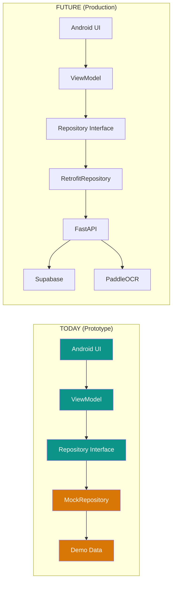
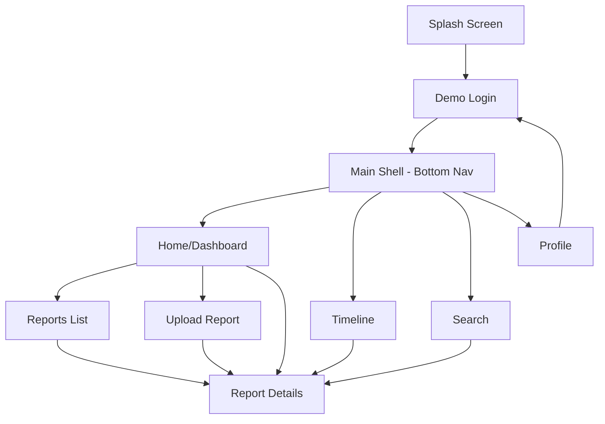

# MEMO — Frontend Prototype + DevOps Demonstration Plan

**Version:** 2.0 — Frontend Prototype  
**Date:** 2026-10-04  
**Status:** Implementation-Ready  
**Scope:** Android Frontend + Demo Data + DevOps Tooling  
**Timeline:** One day (8–12 focused hours)

---

## 1. Executive Summary

This document defines the plan for building a **high-quality Android frontend prototype** of MEMO (Medical Evidence Management & Organization) with realistic local demo data and demonstrable software engineering practices.

**What this plan IS:**
- A temporary frontend + demo data implementation plan
- An academic demonstration of Android development + DevOps tooling
- A polished prototype that can be submitted and demonstrated tomorrow

**What this plan is NOT:**
- A replacement for the existing [DEVELOPMENT_PLAN.md](file:///c:/Users/singh/OneDrive/Desktop/SIH_Project/MEMO_WMAD_project/DEVELOPMENT_PLAN.md)
- A full-stack implementation
- A production backend deployment

**Key Outcome:** The professor experiences a complete user flow — login → dashboard → reports → details → timeline → search → upload → simulated processing → new record appears — while also seeing Jira, GitHub, Jenkins, and Docker in action.

---

## 2. Separation Between Existing Full Project and Today's Frontend Plan

| Aspect | Full Development Plan (existing) | Today's Frontend Plan (this document) |
|---|---|---|
| **Scope** | Complete full-stack: Android + FastAPI + Supabase + PaddleOCR + AI | Android frontend + local demo data + DevOps demo |
| **Authentication** | Supabase Auth with JWT | Demo login with mock user |
| **Data source** | Supabase PostgreSQL via FastAPI | In-memory demo dataset in Kotlin |
| **OCR** | PaddleOCR server-side | Simulated processing with delay animation |
| **Upload** | Multipart → FastAPI → Supabase Storage | File picker → simulated processing → local demo record |
| **Search** | PostgreSQL ILIKE / tsvector | Local string matching on demo data |
| **Docker** | Backend container with PaddleOCR | Reproducible Gradle build environment for Jenkins |
| **Jenkins** | Full pipeline (backend tests + Android build + Docker) | Android-only pipeline (compile + test + lint + APK) |
| **Timeline** | Multi-sprint development | Single day |

> [!IMPORTANT]
> The full architecture defined in `DEVELOPMENT_PLAN.md` remains the canonical production plan. This prototype is Phase 0 — a frontend shell that will later connect to the real backend via the Repository abstraction layer.

### Future Integration Path

```
TODAY:                              FUTURE:
Android UI                         Android UI
    ↓                                  ↓
ViewModel                          ViewModel
    ↓                                  ↓
Repository Interface                Repository Interface
    ↓                                  ↓
MockRepository                     RetrofitRepository
    ↓                                  ↓
Local Demo Data                    Retrofit → FastAPI → Supabase
```

The `Repository Interface` is the integration seam. Swapping `MockRepository` for `RetrofitRepository` requires zero UI changes.

---

## 3. Current Frontend MVP Scope

### Build NOW (today)

| Category | Deliverable |
|---|---|
| **Android UI** | 8 screens: Splash, Login, Dashboard, Reports, Report Details, Timeline, Search, Upload |
| **Navigation** | Bottom nav (4 tabs) + nested navigation |
| **Demo Login** | Prototype login with demo credentials |
| **Dashboard** | Greeting, stats, recent reports, upload CTA |
| **Reports List** | Filterable list with search |
| **Report Details** | Structured lab results, metadata, extraction disclaimer |
| **Timeline** | Chronological view grouped by year/month |
| **Search** | Local text search with dynamic filtering |
| **Upload** | File picker + simulated processing + new record creation |
| **Demo Data** | 10 fictional medical records (2025–2026) |
| **Architecture** | MVVM with Repository abstraction |
| **DevOps** | Git/GitHub + Jira structure + Jenkins pipeline + Docker build env |

### Build LATER (not today)

| Category | Future Phase |
|---|---|
| Supabase Auth | Phase 1 |
| FastAPI backend | Phase 1 |
| PostgreSQL / Supabase DB | Phase 1 |
| Supabase Storage | Phase 1 |
| Real PaddleOCR | Phase 1 |
| AI extraction / classification | Phase 2 |
| RAG / semantic search | Phase 2 |
| Secure record sharing | Phase 2 |
| Cloud deployment | Phase 2 |
| Dark mode | Phase 1 |
| Offline mode | Phase 3 |

---

## 4. Current vs Future Features



| Feature | Today | Future |
|---|---|---|
| Login | Demo credentials | Supabase Auth |
| Data fetching | In-memory Kotlin objects | Retrofit → FastAPI |
| File storage | Not stored (simulated) | Supabase Storage |
| OCR | Simulated delay | PaddleOCR server-side |
| Extraction | Pre-defined demo results | Regex + heuristic pipeline |
| Search | Local string matching | PostgreSQL full-text / RAG |
| Notifications | None | Push notifications |
| Sharing | None | Secure link sharing |

---

## 5. UI/UX Strategy

### Design Philosophy

MEMO should feel like a **personal health companion** — trustworthy, calm, organized. The design language draws from modern health-tech apps (Apple Health, MyChart, Practo) but stays simpler and more focused.

### Visual Principles

| Principle | Application |
|---|---|
| **Trustworthy** | Cool-toned palette (teal/sage), clean typography, generous whitespace |
| **Calm** | No aggressive animations, no red accents except for errors/abnormal values, muted backgrounds |
| **Organized** | Clear visual hierarchy, card-based layouts, consistent spacing |
| **Accessible** | Min 4.5:1 contrast ratio, 14sp min body text, touch targets ≥ 48dp |
| **Modern** | Rounded corners, subtle shadows, Material 3, no skeuomorphism |
| **Healthcare-appropriate** | Teal/green tones (healing), clean white surfaces, medical iconography |

### Key UX Decisions

1. **Bottom navigation with 4 tabs** — Home, Timeline, Search, Profile (Reports accessible from Home)
2. **Upload via FAB** — always visible from Dashboard, primary action
3. **Cards over tables** — more mobile-friendly, easier to scan
4. **Color-coded report types** — instant visual recognition
5. **Extraction disclaimer** on every detail screen — legal/ethical responsibility
6. **Progressive disclosure** — summary first, details on tap

### What to Avoid

- Excessive glassmorphism / gradients
- Over-decoration or visual clutter
- Tiny text or low-contrast elements
- Too many cards competing for attention
- Unnecessary animations that slow the demo
- Generic dashboard templates

---

## 6. Design System

### Color Palette

#### Primary Colors
```
Primary:           #0D9488  (Teal 600 — main brand color)
Primary Container: #CCFBF1  (Teal 100 — light teal for cards/backgrounds)
On Primary:        #FFFFFF  (White text on primary)
On Primary Cont:   #0F766E  (Teal 700 — text on primary container)
```

#### Background & Surface
```
Background:         #FAFBFC  (Very light gray — page background)
Surface:            #FFFFFF  (White — card surfaces)
Surface Variant:    #F1F5F9  (Slate 100 — secondary surfaces)
Outline:            #CBD5E1  (Slate 300 — borders, dividers)
Outline Variant:    #E2E8F0  (Slate 200 — subtle borders)
```

#### Text Colors
```
On Background:      #0F172A  (Slate 900 — primary text)
On Surface:         #1E293B  (Slate 800 — card text)
On Surface Variant: #64748B  (Slate 500 — secondary text)
Caption:            #94A3B8  (Slate 400 — tertiary/caption text)
```

#### Semantic Colors
```
Success:            #059669  (Emerald 600 — in-range values, completed)
Success Container:  #D1FAE5  (Emerald 100)
Warning:            #D97706  (Amber 600 — attention, partial)
Warning Container:  #FEF3C7  (Amber 100)
Error:              #DC2626  (Red 600 — errors, out-of-range values)
Error Container:    #FEE2E2  (Red 100)
Info:               #2563EB  (Blue 600 — informational)
Info Container:     #DBEAFE  (Blue 100)
```

#### Report Type Colors
```
Blood Test:         #0D9488  (Teal)
Urine Test:         #7C3AED  (Violet)
Prescription:       #2563EB  (Blue)
Imaging:            #EA580C  (Orange)
Discharge:          #059669  (Emerald)
Health Checkup:     #D97706  (Amber)
Other:              #64748B  (Slate)
```

### Typography

| Style | Size | Weight | Usage |
|---|---|---|---|
| Display | 28sp | SemiBold | Screen titles (rare) |
| Headline | 22sp | SemiBold | Section headers |
| Title Large | 20sp | Medium | Card titles, report names |
| Title Medium | 16sp | SemiBold | Subsection headers |
| Body Large | 16sp | Regular | Primary body text |
| Body Medium | 14sp | Regular | Secondary body text |
| Body Small | 12sp | Regular | Captions, timestamps |
| Label Large | 14sp | SemiBold | Buttons, chips |
| Label Medium | 12sp | Medium | Small labels |
| Data Value | 16sp | Medium | Lab values (monospace/tabular figures) |

**Font Family:** System default (Roboto on Android) — avoids Google Fonts download latency for demo.

### Spacing System

```
xs:   4dp
sm:   8dp
md:   12dp
lg:   16dp
xl:   20dp
2xl:  24dp
3xl:  32dp
4xl:  40dp
```

### Component Tokens

| Component | Specification |
|---|---|
| **Buttons** | Height: 48dp, Corner: 12dp, Primary fill / Secondary outlined |
| **Text Fields** | Height: 56dp, Corner: 12dp, 1dp border |
| **Cards** | Corner: 16dp, Elevation: 1dp, White surface, 16dp padding |
| **Chips/Tags** | Height: 32dp, Corner: 8dp, 12dp horizontal padding |
| **FAB** | Size: 56dp, Corner: 16dp, Elevation: 6dp |

---

## 7. Screen-by-Screen Specification

### Screen 1: Splash

| Aspect | Specification |
|---|---|
| **Duration** | 1.5 seconds |
| **Content** | App logo/icon, "MEMO" title, "Medical Evidence Management & Organization" subtitle, "Every Report. One Medical Memory." tagline |
| **Layout** | Centered vertically, primary background (#0D9488), white text |
| **Navigation** | Auto → Login (no existing session) |
| **Animation** | Subtle fade-in of text elements |

### Screen 2: Demo Login

| Aspect | Specification |
|---|---|
| **Content** | App logo (small), "Welcome back" heading, Email field, Password field (with visibility toggle), "Sign In" button, "Continue with Demo" button |
| **Demo behavior** | "Continue with Demo" auto-fills `aarav.mehta@memo.demo` and signs in immediately. "Sign In" validates the demo credentials and signs in. |
| **Loading state** | Button shows circular progress, fields disabled |
| **Error state** | Inline error: "Invalid demo credentials" (if user types wrong email/password) |
| **Success** | Navigate to Dashboard |
| **Future** | Replace demo auth with Supabase Auth |

**Accepted demo credentials:**
- Email: `aarav.mehta@memo.demo`
- Password: `demo1234`

### Screen 3: Dashboard

| Aspect | Specification |
|---|---|
| **Greeting** | "Hello, Aarav 👋" with current date |
| **Stats row** | Total Reports (count), Lab Reports (count), Prescriptions (count), Imaging (count) — displayed as compact metric cards |
| **Recent Records** | Last 3–5 reports as ReportCard components |
| **Quick Actions** | "Upload Report" FAB, "View Timeline" button, "Search Records" button |
| **Empty state** | "No reports yet" + "Upload your first report" CTA |
| **Loading state** | Shimmer/skeleton on stats and cards |

### Screen 4: Reports List

| Aspect | Specification |
|---|---|
| **Search bar** | At top, filters list in real-time |
| **Filter chips** | All, Blood, Urine, Prescription, Imaging, Discharge |
| **Report cards** | Type icon + color indicator, title, date, organization, status badge |
| **Sort** | Newest first (default) |
| **Empty filtered** | "No reports matching this filter" |

### Screen 5: Report Details

| Aspect | Specification |
|---|---|
| **Header** | Report type chip (colored), title, date |
| **Info card** | Hospital/lab, patient name, doctor (if available), report ID |
| **Disclaimer** | ⓘ "This data was automatically extracted from the document. Always verify with the original report." |
| **Extracted Results** | Table/list: Test Name, Value, Unit, Reference Range. Abnormal values highlighted with error color. |
| **Original Source** | "View Original Document" section (in demo, shows placeholder noting original stored in Supabase Storage) |
| **For non-lab reports** | Prescription → medication list. Imaging → findings summary. Discharge → summary fields. |

### Screen 6: Medical Timeline

| Aspect | Specification |
|---|---|
| **Structure** | Vertical timeline, year headers, month subheaders |
| **Timeline nodes** | Colored dot (by report type), date, report type label, title, organization |
| **Connecting line** | Vertical line connecting nodes |
| **Interaction** | Tap → Report Details |
| **Empty state** | "Your medical timeline is empty. Upload a report to start building your history." |

Visual structure:
```
── 2026 ──────────────────────────

   October
   ● 02 Oct — Complete Blood Count
     NovaCare Diagnostics

   September
   ● 18 Sep — General Prescription
     CityMed Clinic

   ● 04 Sep — Kidney Function Test
     NovaCare Diagnostics

   August
   ● 12 Aug — Abdominal Ultrasound
     Metro Imaging Centre
```

### Screen 7: Search

| Aspect | Specification |
|---|---|
| **Search bar** | Auto-focus on entry, "Search reports, tests, hospitals..." |
| **Behavior** | Filters demo data by matching query against: title, report type, organization, test names, values |
| **Results** | ReportCard components |
| **Initial state** | Search suggestions: "Try: hemoglobin, blood test, NovaCare, prescription" |
| **No results** | "No reports matching '{query}'" |

### Screen 8: Upload

| Aspect | Specification |
|---|---|
| **File selection** | Large tappable zone with dashed border, document + camera icons |
| **File picker** | Android file picker for PDF/image |
| **Selected state** | File name, file size, "Change" option |
| **Processing** | Simulated 4-step progress with delays: "Uploading document..." (1s) → "Reading document..." (1.5s) → "Extracting information..." (2s) → "Organizing record..." (1s) → "Complete ✓" |
| **Success** | Checkmark animation → "Report processed successfully" → "View Report" button |
| **After success** | New demo record created, appears in Dashboard, Reports, Timeline |

---

## 8. Navigation Architecture



### Navigation Routes

```kotlin
sealed class MemoRoute(val route: String) {
    object Splash : MemoRoute("splash")
    object Login : MemoRoute("login")
    object Dashboard : MemoRoute("dashboard")
    object Reports : MemoRoute("reports")
    object ReportDetail : MemoRoute("report/{reportId}")
    object Timeline : MemoRoute("timeline")
    object Search : MemoRoute("search")
    object Upload : MemoRoute("upload")
    object Profile : MemoRoute("profile")
}
```

### Bottom Navigation Tabs

```
[🏠 Home]   [📊 Timeline]   [🔍 Search]   [👤 Profile]
```

---

## 9. Frontend Architecture

```
┌─────────────────────────────────────────────────────┐
│                    UI Layer                          │
│  ┌──────────┐ ┌──────────┐ ┌──────────┐            │
│  │ Screens  │ │Components│ │  Theme   │            │
│  └────┬─────┘ └──────────┘ └──────────┘            │
│       │                                             │
│  ┌────▼─────────────────────────────────┐           │
│  │          ViewModels                   │           │
│  │  DashboardVM │ ReportsVM │ UploadVM  │           │
│  │  TimelineVM  │ SearchVM  │ AuthVM    │           │
│  └────┬─────────────────────────────────┘           │
│       │                                             │
│  ┌────▼─────────────────────────────────┐           │
│  │       Repository Interface            │           │
│  │  IMemoRepository                      │           │
│  └────┬─────────────────────────────────┘           │
│       │                                             │
│  ┌────▼──────────────┐  ┌──────────────────────┐   │
│  │  MockRepository   │  │  RetrofitRepository  │   │
│  │  (TODAY - active)  │  │  (FUTURE - inactive) │   │
│  └────┬──────────────┘  └──────────────────────┘   │
│       │                                             │
│  ┌────▼──────────────┐                              │
│  │   DemoDataSource   │                              │
│  │  (Kotlin objects)  │                              │
│  └───────────────────┘                              │
└─────────────────────────────────────────────────────┘
```

### Key Interfaces

```kotlin
interface IMemoRepository {
    suspend fun login(email: String, password: String): Result<DemoUser>
    suspend fun getDashboardData(): Result<DashboardData>
    suspend fun getReports(filter: ReportType? = null): Result<List<MedicalReport>>
    suspend fun getReportById(id: String): Result<MedicalReport>
    suspend fun getTimelineEvents(): Result<List<TimelineEvent>>
    suspend fun searchReports(query: String): Result<List<MedicalReport>>
    suspend fun uploadReport(fileName: String, fileSize: Long): Result<MedicalReport>
    suspend fun logout()
}
```

---

## 10. Data Models

### MedicalReport
```kotlin
data class MedicalReport(
    val id: String,               // UUID string
    val title: String,
    val reportType: ReportType,
    val reportDate: LocalDate,
    val hospitalName: String,
    val patientName: String,
    val doctorName: String?,
    val processingStatus: ProcessingStatus,
    val labResults: List<LabResult>,
    val medications: List<Medication>,   // For prescriptions
    val findings: String?,               // For imaging/discharge
    val createdAt: LocalDateTime
)
```

### LabResult
```kotlin
data class LabResult(
    val id: String,
    val testName: String,
    val value: String,
    val unit: String,
    val referenceRange: String,
    val isAbnormal: Boolean,
    val sortOrder: Int
)
```

### TimelineEvent
```kotlin
data class TimelineEvent(
    val reportId: String,
    val date: LocalDate,
    val reportType: ReportType,
    val title: String,
    val organizationName: String
)
```

### DemoUser
```kotlin
data class DemoUser(
    val id: String,
    val fullName: String,
    val email: String,
    val memberSince: LocalDate
)
```

### Enums
```kotlin
enum class ReportType {
    BLOOD_TEST, URINE_TEST, PRESCRIPTION, IMAGING, DISCHARGE, HEALTH_CHECKUP, OTHER
}

enum class ProcessingStatus {
    PENDING, PROCESSING, COMPLETED, FAILED, PARTIAL
}
```

### DashboardData
```kotlin
data class DashboardData(
    val userName: String,
    val totalReports: Int,
    val labReports: Int,
    val prescriptions: Int,
    val imaging: Int,
    val recentReports: List<MedicalReport>
)
```

### Medication (for prescriptions)
```kotlin
data class Medication(
    val name: String,
    val dosage: String,
    val frequency: String,
    val duration: String,
    val notes: String?
)
```

---

## 11. Mock Repository / Demo Data Architecture

### MockMemoRepository

```kotlin
class MockMemoRepository : IMemoRepository {
    
    private val demoDataSource = DemoDataSource()
    private var isLoggedIn = false
    
    override suspend fun login(email: String, password: String): Result<DemoUser> {
        delay(800) // Simulate network
        return if (email == "aarav.mehta@memo.demo" && password == "demo1234") {
            isLoggedIn = true
            Result.success(demoDataSource.demoUser)
        } else {
            Result.failure(Exception("Invalid credentials"))
        }
    }
    
    override suspend fun getReports(filter: ReportType?): Result<List<MedicalReport>> {
        delay(500)
        val reports = if (filter != null) {
            demoDataSource.reports.filter { it.reportType == filter }
        } else {
            demoDataSource.reports
        }
        return Result.success(reports.sortedByDescending { it.reportDate })
    }
    
    override suspend fun uploadReport(fileName: String, fileSize: Long): Result<MedicalReport> {
        // Simulate processing with delays
        delay(1000)  // "Uploading..."
        delay(1500)  // "Reading..."
        delay(2000)  // "Extracting..."
        delay(1000)  // "Organizing..."
        
        val newReport = demoDataSource.createUploadedReport(fileName)
        return Result.success(newReport)
    }
    
    // ... other methods follow same pattern
}
```

### DemoDataSource

Holds all fictional data in memory. Mutable list allows adding "uploaded" reports during the demo session.

### Future swap

```kotlin
// Today:
val repository: IMemoRepository = MockMemoRepository()

// Future:
val repository: IMemoRepository = RetrofitMemoRepository(apiService, authManager)
```

---

## 12. Complete Demo Dataset

### Demo User

| Field | Value |
|---|---|
| Name | Aarav Mehta |
| Email | aarav.mehta@memo.demo |
| Member Since | 2025-06-15 |

### Demo Records (10 reports)

#### Report 1: Complete Blood Count
| Field | Value |
|---|---|
| ID | `rpt-001` |
| Title | Complete Blood Count (CBC) |
| Type | Blood Test |
| Date | 2026-10-02 |
| Organization | NovaCare Diagnostics |
| Doctor | Dr. Priya Sharma |
| **Lab Results:** | |
| Hemoglobin | 13.4 g/dL (Ref: 13.0–17.0) — Normal |
| WBC Count | 7,200 /cumm (Ref: 4,000–11,000) — Normal |
| RBC Count | 4.9 million/cumm (Ref: 4.5–5.5) — Normal |
| Platelet Count | 2.45 lakh/cumm (Ref: 1.5–4.5) — Normal |
| Hematocrit (PCV) | 40.2 % (Ref: 38.0–50.0) — Normal |
| MCV | 82.0 fL (Ref: 80.0–100.0) — Normal |
| MCH | 27.3 pg (Ref: 27.0–32.0) — Normal |
| ESR | 12 mm/hr (Ref: 0–15) — Normal |

#### Report 2: Lipid Profile
| Field | Value |
|---|---|
| ID | `rpt-002` |
| Title | Lipid Profile |
| Type | Blood Test |
| Date | 2026-10-02 |
| Organization | NovaCare Diagnostics |
| Doctor | Dr. Priya Sharma |
| **Lab Results:** | |
| Total Cholesterol | 215 mg/dL (Ref: < 200) — **Abnormal** |
| HDL Cholesterol | 48 mg/dL (Ref: > 40) — Normal |
| LDL Cholesterol | 138 mg/dL (Ref: < 100) — **Abnormal** |
| Triglycerides | 162 mg/dL (Ref: < 150) — **Abnormal** |
| VLDL Cholesterol | 32 mg/dL (Ref: 5–40) — Normal |
| Total/HDL Ratio | 4.5 (Ref: < 5.0) — Normal |

#### Report 3: Fasting Blood Glucose + HbA1c
| Field | Value |
|---|---|
| ID | `rpt-003` |
| Title | Blood Sugar - Fasting & HbA1c |
| Type | Blood Test |
| Date | 2026-09-18 |
| Organization | CityMed Clinic |
| Doctor | Dr. Rajesh Iyer |
| **Lab Results:** | |
| Fasting Glucose | 102 mg/dL (Ref: 70–100) — **Abnormal** |
| HbA1c | 5.8 % (Ref: 4.0–5.6) — **Abnormal** |
| Post-Prandial Glucose | 138 mg/dL (Ref: 70–140) — Normal |

#### Report 4: Thyroid Function Test
| Field | Value |
|---|---|
| ID | `rpt-004` |
| Title | Thyroid Function Test |
| Type | Blood Test |
| Date | 2026-08-04 |
| Organization | NovaCare Diagnostics |
| Doctor | Dr. Priya Sharma |
| **Lab Results:** | |
| TSH | 3.2 mIU/L (Ref: 0.4–4.0) — Normal |
| T3 | 1.1 ng/mL (Ref: 0.8–2.0) — Normal |
| T4 | 7.8 μg/dL (Ref: 5.1–14.1) — Normal |
| Free T3 | 3.1 pg/mL (Ref: 2.0–4.4) — Normal |
| Free T4 | 1.2 ng/dL (Ref: 0.9–1.7) — Normal |

#### Report 5: Urine Routine Examination
| Field | Value |
|---|---|
| ID | `rpt-005` |
| Title | Urine Routine & Microscopy |
| Type | Urine Test |
| Date | 2026-09-18 |
| Organization | CityMed Clinic |
| Doctor | Dr. Rajesh Iyer |
| **Lab Results:** | |
| Color | Pale Yellow (Ref: Pale Yellow) — Normal |
| Appearance | Clear (Ref: Clear) — Normal |
| pH | 6.0 (Ref: 4.5–8.0) — Normal |
| Specific Gravity | 1.020 (Ref: 1.005–1.030) — Normal |
| Protein | Nil (Ref: Nil) — Normal |
| Glucose | Nil (Ref: Nil) — Normal |
| Ketones | Nil (Ref: Nil) — Normal |
| RBC | 0–1 /HPF (Ref: 0–2) — Normal |
| WBC | 2–3 /HPF (Ref: 0–5) — Normal |

#### Report 6: Urine Microalbumin
| Field | Value |
|---|---|
| ID | `rpt-006` |
| Title | Urine Microalbumin Test |
| Type | Urine Test |
| Date | 2026-07-22 |
| Organization | HealthFirst Hospital |
| Doctor | Dr. Anita Desai |
| **Lab Results:** | |
| Microalbumin | 18 mg/L (Ref: < 20) — Normal |
| Creatinine (Urine) | 120 mg/dL (Ref: 20–275) — Normal |
| Albumin/Creatinine Ratio | 15 mg/g (Ref: < 30) — Normal |

#### Report 7: General Prescription
| Field | Value |
|---|---|
| ID | `rpt-007` |
| Title | General Prescription — Follow-up |
| Type | Prescription |
| Date | 2026-09-18 |
| Organization | CityMed Clinic |
| Doctor | Dr. Rajesh Iyer |
| **Medications:** | |
| Metformin 500mg | Twice daily, after meals, 90 days |
| Atorvastatin 10mg | Once daily, at bedtime, 90 days |
| Vitamin D3 60000 IU | Once weekly, 8 weeks |
| **Notes:** | Review with fasting blood glucose after 3 months |

#### Report 8: Monthly Prescription
| Field | Value |
|---|---|
| ID | `rpt-008` |
| Title | Prescription — Seasonal Allergy |
| Type | Prescription |
| Date | 2026-06-10 |
| Organization | HealthFirst Hospital |
| Doctor | Dr. Anita Desai |
| **Medications:** | |
| Cetirizine 10mg | Once daily, at night, 14 days |
| Montelukast 10mg | Once daily, at night, 14 days |
| Fluticasone Nasal Spray | Twice daily, 2 sprays each nostril, 14 days |

#### Report 9: Abdominal Ultrasound
| Field | Value |
|---|---|
| ID | `rpt-009` |
| Title | Abdominal Ultrasound |
| Type | Imaging |
| Date | 2026-08-12 |
| Organization | Metro Imaging Centre |
| Doctor | Dr. Vikram Patel |
| **Findings:** | Liver: Normal size and echotexture. No focal lesion. Gallbladder: Normal, no calculi. Kidneys: Right — 10.2 cm, Left — 10.5 cm, normal cortical echoes. No hydronephrosis. Spleen: Normal. Pancreas: Visualized portion normal. Impression: Normal abdominal ultrasound study. |

#### Report 10: Discharge Summary
| Field | Value |
|---|---|
| ID | `rpt-010` |
| Title | Discharge Summary — Day Care Procedure |
| Type | Discharge |
| Date | 2025-12-15 |
| Organization | HealthFirst Hospital |
| Doctor | Dr. Sanjay Gupta |
| **Findings:** | Admitted for: Endoscopic evaluation. Procedure: Upper GI Endoscopy. Findings: Mild antral gastritis. No ulcer or mass. Biopsy: Taken for H. pylori testing. Condition at discharge: Stable. Follow-up: Review with biopsy report in 1 week. Medications on discharge: Pantoprazole 40mg OD × 4 weeks, Domperidone 10mg TDS × 2 weeks. |

#### Report 11 (created during upload demo): Health Checkup
| Field | Value |
|---|---|
| ID | `rpt-011` |
| Title | Annual Health Checkup |
| Type | Health Checkup |
| Date | 2025-08-20 |
| Organization | NovaCare Diagnostics |
| Doctor | Dr. Priya Sharma |
| **Lab Results:** | |
| Hemoglobin | 12.8 g/dL (Ref: 13.0–17.0) — **Abnormal** |
| Fasting Glucose | 95 mg/dL (Ref: 70–100) — Normal |
| Creatinine | 0.9 mg/dL (Ref: 0.7–1.3) — Normal |
| SGPT (ALT) | 28 U/L (Ref: 7–56) — Normal |
| SGOT (AST) | 24 U/L (Ref: 10–40) — Normal |

> [!NOTE]
> Report 11 represents a "previously uploaded" record from 2025. It's included in the demo dataset. The upload simulation during the demo will create a *new* report (Report 12) with a current date.

#### Report 12 (generated during upload simulation):
| Field | Value |
|---|---|
| ID | `rpt-012` (generated at runtime) |
| Title | Liver Function Test |
| Type | Blood Test |
| Date | 2026-10-04 (today) |
| Organization | NovaCare Diagnostics |
| Doctor | Dr. Priya Sharma |
| **Lab Results:** | |
| Bilirubin (Total) | 0.8 mg/dL (Ref: 0.1–1.2) — Normal |
| Bilirubin (Direct) | 0.2 mg/dL (Ref: 0.0–0.3) — Normal |
| SGPT (ALT) | 32 U/L (Ref: 7–56) — Normal |
| SGOT (AST) | 28 U/L (Ref: 10–40) — Normal |
| Alkaline Phosphatase | 78 U/L (Ref: 44–147) — Normal |
| Total Protein | 7.2 g/dL (Ref: 6.0–8.3) — Normal |
| Albumin | 4.1 g/dL (Ref: 3.5–5.5) — Normal |
| Globulin | 3.1 g/dL (Ref: 2.0–3.5) — Normal |

---

## 13. Jira Structure

### Epics — Current Sprint

| Epic ID | Epic Name | Description | Status |
|---|---|---|---|
| MEMO-E1 | Android Frontend | Core Android app shell, navigation, theme | **Current Sprint** |
| MEMO-E2 | UI/UX Design | Screen implementations, components, polish | **Current Sprint** |
| MEMO-E3 | Demo Data Layer | Mock repository, demo dataset, simulated processing | **Current Sprint** |
| MEMO-E4 | Testing | Unit tests, manual test checklist | **Current Sprint** |
| MEMO-E5 | DevOps | Git/GitHub, Jenkins CI, Docker build env | **Current Sprint** |

### Epics — Future Backlog

| Epic ID | Epic Name | Status |
|---|---|---|
| MEMO-E6 | Backend — FastAPI | **Future / Backlog** |
| MEMO-E7 | Supabase Integration | **Future / Backlog** |
| MEMO-E8 | OCR / AI Pipeline | **Future / Backlog** |
| MEMO-E9 | RAG & Semantic Search | **Future / Backlog** |
| MEMO-E10 | Security & Compliance | **Future / Backlog** |
| MEMO-E11 | Cloud Deployment | **Future / Backlog** |

### User Stories — Current Sprint

---

#### MEMO-101: Demo Login
**Epic:** MEMO-E1 (Android Frontend)  
**Priority:** Highest  
**Story Points:** 3

> As a user, I want to sign in with demo credentials so that I can access the application and explore its features.

**Acceptance Criteria:**
- [ ] Login screen displays email and password fields
- [ ] "Continue with Demo" button auto-fills demo credentials and signs in
- [ ] "Sign In" button validates credentials against demo data
- [ ] Invalid credentials show inline error message
- [ ] Successful login navigates to Dashboard
- [ ] Loading state shown during authentication

**Dependencies:** None  
**Subtasks:**
- MEMO-101a: Create LoginScreen composable with form fields
- MEMO-101b: Create AuthViewModel with login state management
- MEMO-101c: Implement demo credential validation in MockRepository

---

#### MEMO-102: Dashboard — Overview & Stats
**Epic:** MEMO-E2 (UI/UX)  
**Priority:** Highest  
**Story Points:** 5

> As a user, I want to see my recent medical records and summary statistics on the dashboard so that I can quickly understand my medical record status.

**Acceptance Criteria:**
- [ ] Personalized greeting with user's first name
- [ ] Current date displayed
- [ ] Stats cards showing: Total Reports, Lab Reports, Prescriptions, Imaging
- [ ] "Recent Records" section showing last 3–5 reports as ReportCards
- [ ] FAB "+" button visible for uploading new report
- [ ] Empty state with illustration when no reports exist
- [ ] Loading state with shimmer skeleton

**Dependencies:** MEMO-101 (login must work)  
**Subtasks:**
- MEMO-102a: Create DashboardScreen layout
- MEMO-102b: Create MetricCard component
- MEMO-102c: Create DashboardViewModel
- MEMO-102d: Connect to MockRepository

---

#### MEMO-103: Reports List with Filters
**Epic:** MEMO-E2 (UI/UX)  
**Priority:** High  
**Story Points:** 5

> As a user, I want to browse all my medical records with filters so that I can find a specific type of report.

**Acceptance Criteria:**
- [ ] All reports displayed as cards in a scrollable list
- [ ] Filter chips: All, Blood, Urine, Prescription, Imaging, Discharge
- [ ] Selecting a filter updates the list immediately
- [ ] Search bar at top filters by text
- [ ] Report cards show type indicator, title, date, organization
- [ ] Tapping a card navigates to Report Details
- [ ] Empty state when no reports match filter

**Dependencies:** MEMO-102  
**Subtasks:**
- MEMO-103a: Create ReportsListScreen layout
- MEMO-103b: Create ReportCard component
- MEMO-103c: Create FilterChip row
- MEMO-103d: Create ReportsViewModel with filtering logic

---

#### MEMO-104: Report Details — Structured View
**Epic:** MEMO-E2 (UI/UX)  
**Priority:** High  
**Story Points:** 8

> As a user, I want to view the structured information extracted from a medical report so that I can easily read my test results, reference ranges, and any abnormal values.

**Acceptance Criteria:**
- [ ] Report header shows type chip, title, and date
- [ ] Info section shows hospital/lab name, patient name, doctor
- [ ] Extraction disclaimer clearly visible
- [ ] Lab results displayed as table: Test Name, Value, Unit, Reference Range
- [ ] Abnormal values visually highlighted (red/error color)
- [ ] Prescription reports show medication list with dosage/frequency
- [ ] Imaging/discharge reports show findings text
- [ ] "View Original" section present (placeholder for future Supabase Storage)

**Dependencies:** MEMO-103  
**Subtasks:**
- MEMO-104a: Create ReportDetailScreen layout
- MEMO-104b: Create LabResultRow component with abnormal highlighting
- MEMO-104c: Create MedicationRow component
- MEMO-104d: Create extraction disclaimer component
- MEMO-104e: Handle different report types (blood, urine, prescription, imaging, discharge)

---

#### MEMO-105: Medical Timeline
**Epic:** MEMO-E2 (UI/UX)  
**Priority:** High  
**Story Points:** 5

> As a user, I want to see my medical records arranged chronologically so that I can understand my medical history over time.

**Acceptance Criteria:**
- [ ] Timeline displays reports ordered newest-first
- [ ] Reports grouped by year, then by month
- [ ] Year headers clearly separate groups
- [ ] Each entry shows: colored dot, date, report type, title, organization
- [ ] Vertical connecting line between entries
- [ ] Tapping an entry navigates to Report Details
- [ ] Empty state when no reports exist

**Dependencies:** MEMO-103  
**Subtasks:**
- MEMO-105a: Create TimelineScreen layout
- MEMO-105b: Create TimelineItem component with connecting line
- MEMO-105c: Create TimelineViewModel with grouping logic

---

#### MEMO-106: Search Records
**Epic:** MEMO-E2 (UI/UX)  
**Priority:** Medium  
**Story Points:** 3

> As a user, I want to search my medical records by keywords so that I can quickly find a specific report, test, or hospital.

**Acceptance Criteria:**
- [ ] Search bar auto-focuses on screen entry
- [ ] Search dynamically filters demo data as user types
- [ ] Matches against: title, report type, organization, test names
- [ ] Results shown as ReportCard components
- [ ] "No results" state with message
- [ ] Initial state shows search suggestions

**Dependencies:** MEMO-103  
**Subtasks:**
- MEMO-106a: Create SearchScreen layout
- MEMO-106b: Create SearchViewModel with local filtering
- MEMO-106c: Implement debounced search (300ms)

---

#### MEMO-107: Upload Report — Simulated Processing
**Epic:** MEMO-E2 (UI/UX) + MEMO-E3 (Demo Data)  
**Priority:** High  
**Story Points:** 8

> As a user, I want to upload a medical document and see it processed so that my report is added to my medical records.

**Acceptance Criteria:**
- [ ] File selection zone with dashed border, tappable
- [ ] Android file picker opens for PDF/image selection
- [ ] Selected file shows name and size
- [ ] "Upload & Process" button triggers simulated processing
- [ ] Processing shows 4 animated steps with progress
- [ ] After completion, a new demo record is created
- [ ] New record appears in Dashboard, Reports list, and Timeline
- [ ] Success screen shows "View Report" button that opens details
- [ ] App state persists the new report for the rest of the session

**Dependencies:** MEMO-102, MEMO-103  
**Subtasks:**
- MEMO-107a: Create UploadScreen with file selection UI
- MEMO-107b: Create ProcessingSteps component with animations
- MEMO-107c: Create UploadViewModel with processing states
- MEMO-107d: Implement file picker using ActivityResultContracts
- MEMO-107e: Add dynamic report creation to MockRepository

---

#### MEMO-108: App Shell & Navigation
**Epic:** MEMO-E1 (Android Frontend)  
**Priority:** Highest  
**Story Points:** 3

> As a user, I want to navigate between app sections using a bottom navigation bar so that I can easily access Dashboard, Timeline, Search, and Profile.

**Acceptance Criteria:**
- [ ] Bottom navigation with 4 tabs: Home, Timeline, Search, Profile
- [ ] Active tab visually highlighted
- [ ] Navigation preserves screen state
- [ ] Splash screen shows for 1.5 seconds then navigates to Login
- [ ] After login, bottom nav is visible on all main screens
- [ ] Back navigation works correctly

**Dependencies:** None  
**Subtasks:**
- MEMO-108a: Create MemoNavGraph with all routes
- MEMO-108b: Create MemoBottomNav component
- MEMO-108c: Create SplashScreen with auto-navigation
- MEMO-108d: Set up MainActivity as single-activity host

---

#### MEMO-109: Profile & Logout
**Epic:** MEMO-E2 (UI/UX)  
**Priority:** Low  
**Story Points:** 2

> As a user, I want to view my profile information and log out so that I can manage my account.

**Acceptance Criteria:**
- [ ] Profile shows user name, email
- [ ] Shows stats: total reports, member since date
- [ ] "Log Out" button navigates back to Login screen
- [ ] Login screen backstack is cleared after logout

**Dependencies:** MEMO-101  
**Subtasks:**
- MEMO-109a: Create ProfileScreen layout
- MEMO-109b: Implement logout flow with backstack clearing

---

#### MEMO-110: Design System Implementation
**Epic:** MEMO-E1 (Android Frontend)  
**Priority:** Highest  
**Story Points:** 3

> As a developer, I want a consistent design system so that the app looks professional and all screens share a unified visual language.

**Acceptance Criteria:**
- [ ] Color tokens defined matching design spec (teal primary, semantic colors)
- [ ] Typography scale defined (Display through Label)
- [ ] Shape tokens defined (corner radii for cards, buttons, chips)
- [ ] MemoTheme composable wraps the app
- [ ] Report type colors defined

**Dependencies:** None  
**Subtasks:**
- MEMO-110a: Create Color.kt with all color tokens
- MEMO-110b: Create Type.kt with typography styles
- MEMO-110c: Create Theme.kt with MemoTheme
- MEMO-110d: Create Shape.kt with corner tokens

---

#### MEMO-111: Reusable Component Library
**Epic:** MEMO-E2 (UI/UX)  
**Priority:** High  
**Story Points:** 5

> As a developer, I want reusable UI components so that screens are consistent and development is faster.

**Acceptance Criteria:**
- [ ] ReportCard — shows report summary with type indicator
- [ ] MetricCard — compact stat display
- [ ] TimelineItem — timeline entry with connecting line
- [ ] SearchBar — search input with clear button
- [ ] FilterChip — selectable filter option
- [ ] StatusBadge — processing status indicator
- [ ] EmptyState — empty screen with icon, message, CTA
- [ ] LoadingShimmer — skeleton loading placeholder
- [ ] ProcessingSteps — multi-step progress indicator
- [ ] SectionHeader — section title with optional action
- [ ] MemoTopBar — consistent top bar

**Dependencies:** MEMO-110  
**Subtasks:**
- MEMO-111a: Create all components listed above
- MEMO-111b: Ensure all components use design system tokens
- MEMO-111c: Test components with preview

---

#### MEMO-112: Demo Data Integration
**Epic:** MEMO-E3 (Demo Data)  
**Priority:** High  
**Story Points:** 5

> As a developer, I want a complete demo dataset behind a repository abstraction so that the app demonstrates realistic medical records and can later swap in the real backend.

**Acceptance Criteria:**
- [ ] IMemoRepository interface defined
- [ ] MockMemoRepository implements the interface
- [ ] DemoDataSource provides 10+ fictional medical records
- [ ] Records span 2025–2026 with realistic distribution
- [ ] All reports have plausible lab values and metadata
- [ ] Simulated delays mimic network latency
- [ ] Upload simulation creates new records dynamically
- [ ] Repository is injectable/swappable

**Dependencies:** None  
**Subtasks:**
- MEMO-112a: Define IMemoRepository interface
- MEMO-112b: Create DemoDataSource with all records
- MEMO-112c: Implement MockMemoRepository
- MEMO-112d: Wire repository into ViewModels

---

#### MEMO-113: Unit Tests
**Epic:** MEMO-E4 (Testing)  
**Priority:** Medium  
**Story Points:** 3

> As a developer, I want unit tests for the repository and ViewModel layers so that I can demonstrate testing practices and verify correctness.

**Acceptance Criteria:**
- [ ] MockRepository returns correct data for each method
- [ ] Login validation works for valid and invalid credentials
- [ ] Search filtering matches expected results
- [ ] Report type filtering works correctly
- [ ] At least 8 meaningful test cases

**Dependencies:** MEMO-112  
**Subtasks:**
- MEMO-113a: Create test class for MockMemoRepository
- MEMO-113b: Create test class for search/filter logic
- MEMO-113c: Verify all tests pass via Gradle

---

#### MEMO-114: Jenkins CI Pipeline
**Epic:** MEMO-E5 (DevOps)  
**Priority:** Medium  
**Story Points:** 3

> As a developer, I want a Jenkins CI pipeline that builds and tests the Android project so that I can demonstrate automated build/test practices.

**Acceptance Criteria:**
- [ ] Jenkinsfile defines a multi-stage pipeline
- [ ] Pipeline stages: Checkout → Compile → Test → Lint → APK → Archive
- [ ] Pipeline runs on push to GitHub
- [ ] Build success/failure visible in Jenkins dashboard
- [ ] Debug APK generated as build artifact

**Dependencies:** MEMO-113  
**Subtasks:**
- MEMO-114a: Write Jenkinsfile with pipeline stages
- MEMO-114b: Configure Jenkins job linked to GitHub repo
- MEMO-114c: Verify pipeline runs successfully

---

#### MEMO-115: Docker Build Environment
**Epic:** MEMO-E5 (DevOps)  
**Priority:** Low  
**Story Points:** 2

> As a developer, I want a Docker-based build environment so that the Android build is reproducible and independent of the local machine.

**Acceptance Criteria:**
- [ ] Dockerfile defines an Android SDK + Gradle build environment
- [ ] Container can checkout and build the Android project
- [ ] Jenkins can use the Docker container as a build agent
- [ ] Docker usage is documented

**Dependencies:** MEMO-114  
**Subtasks:**
- MEMO-115a: Create Dockerfile for Android build environment
- MEMO-115b: Test build inside container
- MEMO-115c: Document Docker integration with Jenkins

---

### Story Point Summary

| Priority | Stories | Points |
|---|---|---|
| Highest | MEMO-101, 102, 108, 110 | 14 |
| High | MEMO-103, 104, 105, 107, 111, 112 | 36 |
| Medium | MEMO-106, 113, 114 | 9 |
| Low | MEMO-109, 115 | 4 |
| **Total** | **15 stories** | **63 points** |

---

## 14. Git/GitHub Strategy

### Repository

- **Single monorepo:** `MEMO_WMAD_project` (existing)
- **Remote:** GitHub (to be created: `shivamshivam137/MEMO_WMAD_project` or similar)

### Branch Structure

```
main              ← stable, demo-ready
├── develop       ← integration branch
    ├── feature/app-shell       (MEMO-108, MEMO-110)
    ├── feature/dashboard       (MEMO-102)
    ├── feature/reports         (MEMO-103, MEMO-104)
    ├── feature/timeline        (MEMO-105)
    ├── feature/search          (MEMO-106)
    ├── feature/upload-demo     (MEMO-107)
    ├── feature/demo-data       (MEMO-112)
    ├── feature/ui-components   (MEMO-111)
    ├── feature/auth            (MEMO-101, MEMO-109)
    ├── feature/testing         (MEMO-113)
    └── feature/ci-docker       (MEMO-114, MEMO-115)
```

### Branch Naming Convention

```
feature/<short-description>       ← new features
fix/<short-description>           ← bug fixes
chore/<short-description>         ← maintenance, config
docs/<short-description>          ← documentation only
```

### Commit Convention

```
type(scope): description [MEMO-XXX]

Examples:
feat(android): implement splash and login screens [MEMO-101]
feat(ui): create ReportCard and MetricCard components [MEMO-111]
feat(data): add complete demo dataset with 10 records [MEMO-112]
feat(dashboard): implement dashboard with stats and recent reports [MEMO-102]
fix(nav): fix back navigation from report details
style(theme): adjust primary teal color values [MEMO-110]
test(repo): add unit tests for MockMemoRepository [MEMO-113]
chore(ci): add Jenkinsfile and Docker build config [MEMO-114]
docs: update README with setup instructions
```

**Types:** `feat`, `fix`, `refactor`, `style`, `docs`, `test`, `chore`

### When to Commit

- After each logical unit of work compiles successfully
- After completing each subtask
- Before starting a different feature area
- After fixing a bug
- Aim for 15–25 commits for the full day

### Pull Request Strategy

For each feature branch:
1. Create PR: `feature/xxx → develop`
2. PR title: `feat: description [MEMO-XXX]`
3. PR body: Brief description + screenshots (for UI changes)
4. Self-merge after review (solo project)

At the end of the day:
- `develop → main` as final PR
- Tag: `v0.1.0-prototype`

### Jira Linking

- Commit messages include `[MEMO-XXX]` reference
- PR titles include `[MEMO-XXX]` reference
- Branch names correspond to Jira stories
- Jira stories link to GitHub PRs in comments

---

## 15. Jenkins CI Plan

### Pipeline Overview

```
GitHub push/PR
       ↓
Jenkins (Webhook or Poll SCM)
       ↓
┌──────────────────────────────┐
│ Stage 1: Checkout            │
│ Clone repository from GitHub │
├──────────────────────────────┤
│ Stage 2: Setup               │
│ Verify Gradle, SDK, JDK     │
├──────────────────────────────┤
│ Stage 3: Compile             │
│ ./gradlew compileDebugKotlin │
├──────────────────────────────┤
│ Stage 4: Unit Tests          │
│ ./gradlew testDebugUnitTest  │
├──────────────────────────────┤
│ Stage 5: Lint                │
│ ./gradlew lintDebug          │
├──────────────────────────────┤
│ Stage 6: Build APK           │
│ ./gradlew assembleDebug      │
├──────────────────────────────┤
│ Stage 7: Archive             │
│ Archive debug APK artifact   │
└──────────────────────────────┘
```

### Jenkinsfile

```groovy
pipeline {
    agent any

    environment {
        ANDROID_HOME = "${env.HOME}/Android/Sdk"
        GRADLE_USER_HOME = "${WORKSPACE}/.gradle"
    }

    stages {
        stage('Checkout') {
            steps {
                checkout scm
                echo 'Repository checked out successfully'
            }
        }

        stage('Setup') {
            steps {
                dir('android') {
                    sh 'chmod +x gradlew'
                    sh './gradlew --version'
                }
            }
        }

        stage('Compile') {
            steps {
                dir('android') {
                    sh './gradlew compileDebugKotlin'
                }
            }
        }

        stage('Unit Tests') {
            steps {
                dir('android') {
                    sh './gradlew testDebugUnitTest'
                }
            }
            post {
                always {
                    junit 'android/app/build/test-results/**/*.xml'
                }
            }
        }

        stage('Lint') {
            steps {
                dir('android') {
                    sh './gradlew lintDebug'
                }
            }
            post {
                always {
                    archiveArtifacts artifacts: 'android/app/build/reports/lint-results-debug.html',
                                     allowEmptyArchive: true
                }
            }
        }

        stage('Build Debug APK') {
            steps {
                dir('android') {
                    sh './gradlew assembleDebug'
                }
            }
        }

        stage('Archive APK') {
            steps {
                archiveArtifacts artifacts: 'android/app/build/outputs/apk/debug/app-debug.apk',
                                 fingerprint: true
            }
        }
    }

    post {
        success {
            echo 'MEMO Android build completed successfully!'
        }
        failure {
            echo 'MEMO build failed. Check logs for details.'
        }
        always {
            cleanWs()
        }
    }
}
```

### Stage Details

| Stage | Purpose | Expected Output | Failure Condition |
|---|---|---|---|
| Checkout | Clone repo | Working directory ready | Git connection / auth failure |
| Setup | Verify build tools | Gradle version printed | Missing Gradle wrapper |
| Compile | Compile Kotlin sources | `.class` files generated | Syntax/type errors |
| Unit Tests | Run JUnit tests | Test results XML | Any test failure |
| Lint | Static analysis | Lint report HTML | Critical lint errors |
| Build APK | Generate debug APK | `app-debug.apk` | Build configuration errors |
| Archive | Store build artifacts | APK downloadable from Jenkins | Archive failure |

### Required Jenkins Plugins

- Git plugin
- JUnit plugin
- Pipeline plugin
- HTML Publisher (for lint reports)
- Android-related (optional — if using Docker agent, not needed)

### What to Show Professor

1. Jenkins dashboard with MEMO project
2. Build history showing successful builds
3. Click into a build → show pipeline stages (all green)
4. Show test results summary
5. Show archived APK artifact
6. Show Jenkinsfile in the repository

---

## 16. Docker Plan

### Why Docker Is Being Used Now

Docker provides a **reproducible build environment** for the Android project. This ensures:
- The Jenkins pipeline produces consistent results regardless of the host machine
- Anyone with Docker can build the project without installing Android SDK, JDK, etc.
- Demonstrates containerization skills for the academic evaluation

### Approach: Option A — Android Build Environment Container

This is the simplest and most defensible approach. No fake backend, no unnecessary services.

### Dockerfile

```dockerfile
# android-build.Dockerfile
# Purpose: Reproducible Android build environment
# Usage: Jenkins agent or local builds

FROM openjdk:17-slim

# Environment
ENV ANDROID_SDK_ROOT=/opt/android-sdk
ENV ANDROID_HOME=${ANDROID_SDK_ROOT}
ENV PATH="${PATH}:${ANDROID_SDK_ROOT}/cmdline-tools/latest/bin:${ANDROID_SDK_ROOT}/platform-tools"

# Install prerequisites
RUN apt-get update && apt-get install -y \
    wget \
    unzip \
    git \
    && rm -rf /var/lib/apt/lists/*

# Install Android Command Line Tools
RUN mkdir -p ${ANDROID_SDK_ROOT}/cmdline-tools && \
    cd ${ANDROID_SDK_ROOT}/cmdline-tools && \
    wget -q https://dl.google.com/android/repository/commandlinetools-linux-11076708_latest.zip -O tools.zip && \
    unzip -q tools.zip && \
    mv cmdline-tools latest && \
    rm tools.zip

# Accept licenses and install SDK components
RUN yes | sdkmanager --licenses > /dev/null 2>&1 && \
    sdkmanager \
    "platforms;android-34" \
    "build-tools;34.0.0" \
    "platform-tools"

# Working directory
WORKDIR /project

# Default command
CMD ["./gradlew", "assembleDebug"]
```

### How to Build the Docker Image

```bash
docker build -t memo-android-build -f android-build.Dockerfile .
```

### How to Run a Build Locally

```bash
docker run --rm -v $(pwd)/android:/project memo-android-build
```

### How Jenkins Uses It

In Jenkinsfile, optionally use Docker as the build agent:

```groovy
pipeline {
    agent {
        docker {
            image 'memo-android-build'
            args '-v ${WORKSPACE}/android:/project'
        }
    }
    // ... stages remain the same
}
```

### Container Purpose Summary

| Aspect | Detail |
|---|---|
| **What it contains** | JDK 17, Android SDK 34, build tools, Gradle wrapper |
| **What it does** | Compiles Kotlin, runs tests, generates APK |
| **What it produces** | `app-debug.apk`, test results, lint reports |
| **What it does NOT do** | Run the app, provide a backend, serve data |

### Connection to Future Architecture

```
TODAY:
Docker → Android build environment → Jenkins

FUTURE (additional containers):
Docker Compose →
  ├── memo-backend (FastAPI + PaddleOCR)
  ├── memo-android-build (unchanged)
  └── (Supabase remains SaaS)
```

The Android build container is independent and will coexist with future backend containers without conflict.

---

## 17. One-Day Implementation Schedule

**Assumption:** ~10 focused hours, starting now (05:30 AM IST, submission tomorrow).

### Block 1: Project Setup (05:30 – 06:30) — 1 hour
- [ ] Create Android project with Jetpack Compose (min SDK 26, target SDK 34)
- [ ] Set up `build.gradle.kts` with dependencies (Compose, Navigation, ViewModel, Coroutines)
- [ ] Verify project compiles and runs on emulator
- [ ] Set up package structure
- **Commit:** `chore(android): initialize project with Compose dependencies [MEMO-108]`

### Block 2: Theme + Navigation + Components (06:30 – 08:00) — 1.5 hours
- [ ] Implement Color.kt, Type.kt, Theme.kt, Shape.kt
- [ ] Implement MemoNavGraph with all routes
- [ ] Implement MemoBottomNav
- [ ] Create placeholder screens for all destinations
- [ ] Create reusable components: ReportCard, MetricCard, TimelineItem, SearchBar, FilterChip, EmptyState, StatusBadge, SectionHeader, ProcessingSteps, LoadingShimmer
- **Commits:** `feat(theme): implement MEMO design system [MEMO-110]`, `feat(nav): set up navigation graph and bottom nav [MEMO-108]`, `feat(ui): create reusable component library [MEMO-111]`

### Block 3: Demo Data + Repository (08:00 – 09:00) — 1 hour
- [ ] Define data models (MedicalReport, LabResult, etc.)
- [ ] Define IMemoRepository interface
- [ ] Create DemoDataSource with all 11 records
- [ ] Implement MockMemoRepository
- **Commit:** `feat(data): implement demo data layer with 11 records [MEMO-112]`

### Block 4: Auth + Splash (09:00 – 09:30) — 30 minutes
- [ ] Implement SplashScreen
- [ ] Implement LoginScreen with demo credentials
- [ ] Create AuthViewModel
- **Commit:** `feat(auth): implement splash and demo login [MEMO-101]`

### Block 5: Dashboard (09:30 – 10:30) — 1 hour
- [ ] Implement DashboardScreen with stats, recent reports, FAB
- [ ] Create DashboardViewModel
- [ ] Connect to MockRepository
- [ ] Implement empty/loading states
- **Commit:** `feat(dashboard): implement dashboard with stats and recent reports [MEMO-102]`

### Block 6: Reports List + Details (10:30 – 12:00) — 1.5 hours
- [ ] Implement ReportsListScreen with filters
- [ ] Implement ReportDetailScreen with lab results table
- [ ] Handle different report types (blood, urine, prescription, imaging, discharge)
- [ ] Abnormal value highlighting
- [ ] Extraction disclaimer
- **Commits:** `feat(reports): implement reports list with filters [MEMO-103]`, `feat(reports): implement report details with lab results [MEMO-104]`

### Block 7: Timeline (12:00 – 12:45) — 45 minutes
- [ ] Implement TimelineScreen with year/month grouping
- [ ] Connect to MockRepository
- **Commit:** `feat(timeline): implement chronological medical timeline [MEMO-105]`

### Block 8: Search (12:45 – 13:15) — 30 minutes
- [ ] Implement SearchScreen with local filtering
- [ ] Create SearchViewModel with debounced search
- **Commit:** `feat(search): implement local search with dynamic filtering [MEMO-106]`

### BREAK (13:15 – 13:45)

### Block 9: Upload + Processing (13:45 – 15:00) — 1.25 hours
- [ ] Implement UploadScreen with file picker
- [ ] Implement simulated processing with animated steps
- [ ] Create new demo record after simulation
- [ ] Navigate to new report details on success
- [ ] Verify new report appears in dashboard, reports, timeline
- **Commit:** `feat(upload): implement upload flow with simulated processing [MEMO-107]`

### Block 10: Profile + Polish (15:00 – 16:00) — 1 hour
- [ ] Implement ProfileScreen with logout
- [ ] UI polish pass on all screens
- [ ] Fix any navigation issues
- [ ] Ensure consistent theming
- **Commits:** `feat(profile): implement profile and logout [MEMO-109]`, `style(ui): polish all screens for demo readiness`

### Block 11: Testing (16:00 – 16:30) — 30 minutes
- [ ] Write unit tests for MockMemoRepository
- [ ] Write unit tests for search/filter logic
- [ ] Verify all tests pass
- **Commit:** `test(repo): add unit tests for repository and filtering [MEMO-113]`

### Block 12: Git/GitHub + DevOps (16:30 – 17:30) — 1 hour
- [ ] Push all code to GitHub with organized branches
- [ ] Create 2–3 PRs and merge
- [ ] Set up Jenkins pipeline (write Jenkinsfile, trigger build)
- [ ] Create Docker build environment file
- [ ] Set up Jira board with epics and stories
- **Commits:** `chore(ci): add Jenkinsfile for Android CI pipeline [MEMO-114]`, `chore(docker): add Android build environment Dockerfile [MEMO-115]`

### Block 13: Final Verification (17:30 – 18:00) — 30 minutes
- [ ] Run complete demo flow end-to-end
- [ ] Fix any remaining issues
- [ ] Final merge to main
- [ ] Tag release `v0.1.0-prototype`
- **Commit:** `chore: prepare v0.1.0-prototype for submission`

---

## 18. Professor Demo Flow

### Duration: 5–10 minutes

### Script

**Part 1: Engineering Practices (2 minutes)**

1. **Jira:** "We're using Jira for project management. Here are our epics for the current sprint — Android Frontend, UI/UX, Demo Data, Testing, and DevOps. Future epics for the backend, AI, and cloud deployment are in the backlog." *→ Show Jira board with stories.*

2. **GitHub:** "The code is version-controlled with Git/GitHub. We follow a feature-branch workflow with conventional commits." *→ Show repository, branches, commit history, pull requests.*

3. **Jenkins:** "We have a CI pipeline that automatically builds, tests, and generates the APK on every push." *→ Show Jenkins dashboard, pipeline stages, test results, archived APK.*

4. **Docker:** "We use Docker to provide a reproducible build environment, ensuring consistent builds regardless of the developer's machine." *→ Show Dockerfile, briefly explain.*

**Part 2: Application Demo (5 minutes)**

5. **Launch MEMO.** *→ Splash screen: "MEMO — Every Report. One Medical Memory."*

6. **Login.** *→ "Continue with Demo" → Dashboard loads.*

7. **Dashboard.** "This is the main dashboard showing Aarav Mehta's medical record overview — 11 total reports, broken down by category, with recent records below."

8. **Reports list.** *→ Tap "View All"* → "Here are all records. I can filter by type." *→ Select Blood filter → show filtered results.*

9. **Report details.** *→ Tap CBC report.* "Here are the structured results extracted from the document — test names, values, units, reference ranges. Notice the disclaimer: this data was automatically extracted and should always be verified with the original."

10. **Abnormal values.** *→ Open Lipid Profile.* "Notice these values are highlighted — Total Cholesterol, LDL, and Triglycerides are outside the reference range. The app flags them but does not provide medical interpretation."

11. **Timeline.** *→ Navigate to Timeline tab.* "The medical timeline shows all records chronologically, grouped by year and month. This gives a clear picture of the medical history."

12. **Search.** *→ Navigate to Search tab.* *Type "hemoglobin".* "Search dynamically filters records. I can search by test name, hospital, report type." *→ Show result → tap to open.*

13. **Upload.** *→ Return to Dashboard → Tap FAB "+" → Select a file → "Upload & Process".* "Now I'm uploading a new report. The system simulates the processing pipeline — uploading, reading the document, extracting information, organizing."  *→ Watch processing steps.* "Processing complete! Let me view the report." *→ Show new report details.*

14. **Verify integration.** *→ Go back to Dashboard.* "The count has increased. The new report appears in recent records." *→ Check Timeline.* "It's also on the timeline."

**Part 3: Architecture Summary (1 minute)**

15. **Current vs Future.** "MEMO currently demonstrates the Android frontend with realistic demo data, navigation, medical-record visualization, search, and upload workflow. The architecture uses a Repository abstraction layer — right now backed by local demo data. In the next phase, we'll replace this with a FastAPI backend connecting to Supabase for authentication, PostgreSQL for data, and PaddleOCR for real document processing. The UI requires zero changes for this transition."

---

## 19. Testing Checklist

### Manual Test Checklist

```
SPLASH & AUTH
[ ] Splash screen displays for ~1.5s then navigates to Login
[ ] Login screen renders with all fields
[ ] "Continue with Demo" signs in successfully
[ ] Valid demo credentials (aarav.mehta@memo.demo / demo1234) work
[ ] Invalid credentials show error message
[ ] After login, Dashboard is displayed

DASHBOARD
[ ] Greeting shows "Hello, Aarav 👋"
[ ] Stats show correct counts (total, lab, prescription, imaging)
[ ] Recent reports section shows reports
[ ] FAB "+" button is visible and tappable

REPORTS
[ ] All reports listed with correct info
[ ] Filter chips work (Blood, Urine, Prescription, etc.)
[ ] Tapping report card opens details

REPORT DETAILS
[ ] Report header shows type, title, date
[ ] Info section shows hospital, patient, doctor
[ ] Extraction disclaimer is visible
[ ] Lab results table displays correctly
[ ] Abnormal values are highlighted
[ ] Prescription reports show medication list
[ ] Imaging reports show findings

TIMELINE
[ ] Reports displayed in chronological order
[ ] Grouped by year and month
[ ] Year headers visible
[ ] Tapping entry opens report details

SEARCH
[ ] Search bar auto-focuses
[ ] Typing filters results dynamically
[ ] "hemoglobin" returns blood test reports
[ ] "NovaCare" returns matching reports
[ ] No-results state displays correctly

UPLOAD
[ ] File selection zone is tappable
[ ] File picker opens
[ ] After selection, file info displayed
[ ] "Upload & Process" triggers processing animation
[ ] 4 processing steps animate in sequence
[ ] Success screen shows checkmark and "View Report"
[ ] New report appears in Dashboard
[ ] New report appears in Reports list
[ ] New report appears in Timeline

PROFILE
[ ] Shows user name and email
[ ] Shows total reports and member since
[ ] "Log Out" navigates to Login
[ ] Cannot navigate back to Dashboard after logout

NAVIGATION
[ ] Bottom nav tabs work correctly
[ ] Active tab highlighted
[ ] Back navigation works
[ ] No crashes during rapid navigation

VISUAL
[ ] Consistent colors across all screens
[ ] Text is readable (no tiny or overflowing text)
[ ] Cards have proper spacing
[ ] No broken layouts on any screen
[ ] Loading states don't flash
```

### Unit Tests

```
[ ] MockMemoRepository.login() returns success for valid credentials
[ ] MockMemoRepository.login() returns failure for invalid credentials
[ ] MockMemoRepository.getReports() returns all reports
[ ] MockMemoRepository.getReports(BLOOD_TEST) returns only blood tests
[ ] MockMemoRepository.getReportById() returns correct report
[ ] MockMemoRepository.searchReports("hemoglobin") returns matching reports
[ ] MockMemoRepository.searchReports("xyz123") returns empty list
[ ] MockMemoRepository.uploadReport() adds new report to collection
[ ] DashboardData stats match report counts
[ ] Timeline events are sorted by date descending
```

---

## 20. Definition of Done

Today's build is **complete** when:

### Application
- [ ] Android project builds without errors (`./gradlew assembleDebug`)
- [ ] App launches on emulator/device without crashes
- [ ] Complete demo flow works end-to-end without errors
- [ ] UI is visually polished — consistent theme, readable text, proper spacing
- [ ] All 8 screens function correctly
- [ ] Navigation works without issues
- [ ] Demo login works
- [ ] Upload simulation creates a new persistent report
- [ ] No placeholder content visible during demo

### Engineering
- [ ] Git history contains 15+ meaningful commits
- [ ] GitHub repository is organized with branches
- [ ] At least 2 PRs created and merged
- [ ] Jira board has epics and user stories
- [ ] Unit tests pass (`./gradlew testDebugUnitTest`)
- [ ] Jenkinsfile present and pipeline stages defined
- [ ] Dockerfile present for build environment

### Demo
- [ ] 5–10 minute demo can be completed without touching source code
- [ ] Professor can see Jira, GitHub, Jenkins, Docker evidence
- [ ] App behavior is reliable and predictable

---

## 21. Future Backend Integration Points

When the backend is ready, the following changes enable full integration:

### 1. Authentication
```kotlin
// Replace:
class MockMemoRepository : IMemoRepository {
    override suspend fun login(...) { /* demo check */ }
}

// With:
class RetrofitMemoRepository(
    private val api: MemoApiService,
    private val supabaseAuth: SupabaseAuthClient
) : IMemoRepository {
    override suspend fun login(...) {
        supabaseAuth.signInWithPassword(email, password)
    }
}
```

### 2. Data Fetching
```kotlin
// Replace: demoDataSource.reports
// With: api.getReports().body().reports.map { it.toDomain() }
```

### 3. File Upload
```kotlin
// Replace: delay-based simulation
// With: api.uploadReport(multipartBody)
```

### 4. Search
```kotlin
// Replace: local string matching
// With: api.searchReports(query)
```

### 5. Dependencies to Add
```
implementation("com.squareup.retrofit2:retrofit:2.9.0")
implementation("com.squareup.retrofit2:converter-moshi:2.9.0")
implementation("io.github.jan-tennert.supabase:gotrue-kt:2.x.x")
```

### UI Changes Required: **None**

The ViewModels call Repository methods. Screens observe ViewModel state. The data source behind the Repository is invisible to the UI layer.

---

## 22. Risks and Mitigations

| # | Risk | Severity | Likelihood | Mitigation |
|---|---|---|---|---|
| R1 | **Time overrun on UI implementation** | High | Medium | Prioritize: Dashboard → Reports → Details → Timeline. Skip Search/Profile polish if needed. |
| R2 | **Android build configuration issues** | High | Medium | Use known-good Compose BOM version. Verify build after every dependency change. |
| R3 | **Navigation complexity** | Medium | Medium | Start with simple NavHost. Add bottom nav after basic routes work. |
| R4 | **Emulator crashes during demo** | High | Low | Test on physical device if available. Keep emulator warm before demo. |
| R5 | **Jenkins setup takes too long** | Medium | Medium | Jenkinsfile is code — professor can read it even if Jenkins isn't fully configured. |
| R6 | **Docker image build takes too long** | Low | Medium | Dockerfile is the deliverable. Building the image is optional for the demo. |
| R7 | **Upload file picker doesn't work** | Medium | Low | Test file picker early. Have a fallback (button that directly triggers simulated processing). |
| R8 | **Jira board not ready** | Low | Low | Can be set up in 15 minutes. Low priority — do last. |

### Fallback Priority

If time is critically short, deliver in this exact order:

1. ✅ Buildable app with theme + navigation
2. ✅ Dashboard with stats and recent reports
3. ✅ Reports list with filter
4. ✅ Report details with lab results
5. ✅ Timeline
6. ✅ Upload with simulated processing
7. ✅ Search
8. ✅ Profile with logout
9. ✅ Unit tests
10. ✅ Git/GitHub organized
11. ✅ Jenkinsfile
12. ✅ Dockerfile
13. ✅ Jira stories

**A polished working frontend with 6 screens is better than a buggy app with 8 screens.**

---

## Academic Presentation Talking Points

### Current Implementation
"MEMO currently demonstrates the Android frontend, information architecture, user experience, navigation, medical-record visualization, search, and upload workflow using realistic local demo data. The app contains 11 medical records spanning blood tests, urine tests, prescriptions, imaging, and discharge summaries."

### Engineering Practices
"We follow Jira-based project management with epics, user stories, and acceptance criteria. The codebase uses Git/GitHub with a feature-branch workflow, conventional commits, and pull requests. Jenkins provides automated CI with compile, test, lint, and APK generation stages. Docker provides a reproducible build environment."

### Architecture Decision
"The application uses an MVVM architecture with a Repository abstraction layer. Currently, the Repository is backed by in-memory demo data. This same interface will later be implemented with Retrofit calling our FastAPI backend, which connects to Supabase for authentication, PostgreSQL for data storage, and PaddleOCR for document processing. The frontend requires zero changes for this transition."

### What This Is NOT
"This prototype does not claim to perform real OCR, AI-based extraction, or clinical analysis. The upload processing is simulated. The demo data is entirely fictional. The backend, authentication, and cloud deployment are planned for subsequent phases."

---

> [!TIP]
> **Ready to implement.** Start with Block 1: Create the Android project. The plan is designed so each block produces a working, compilable state.
